# Wagecraft user manual

Wagecraft runs a small Philippine company's attendance, leave and payroll on one Windows PC. This
manual says what each screen does and who can use it. It is written for the three kinds of
users:

- **Admin** sets the company up, manages user accounts, backups and settings, and can do
  everything HR can.
- **HR** keeps the employee records, attendance, leave and overtime, and runs payroll.
- **Staff** see their own attendance, leave, payslips and profile, and file leave and overtime.

The time clock, where employees clock in and out, needs no sign-in at all.

The screenshots show the 200-employee demo company. They were taken on a Linux build, so file
paths on them look different from Windows; everything else is the same.

## 1. Getting started

### Install

Run the installer from the GitHub Release. It installs for the current Windows user only, so it
needs no administrator rights, and it installs the WebView2 runtime if the PC lacks it. The
installer is not code-signed, so Windows SmartScreen shows "Windows protected your PC" the first
time: click **More info**, then **Run anyway**.

### First run

The first time Wagecraft starts it has no data, so it opens the setup wizard. Enter the company
name and create the first Admin account. The wizard never shows again once an account exists.

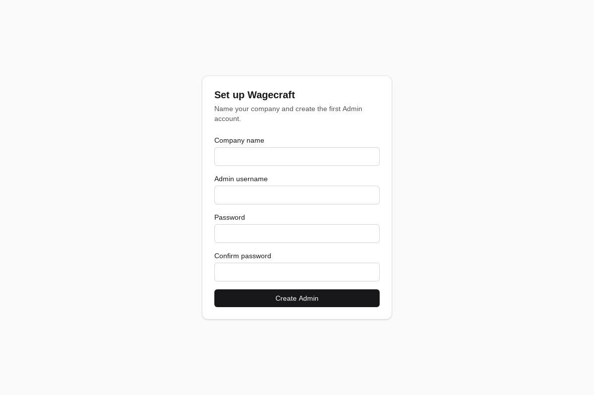

Passwords must be at least 10 characters and can't be the username. Three or four unrelated
words make a strong password that is easy to remember.

### Sign in and out

Everyone with an account signs in with a username and password. **Sign out** is at the top right.

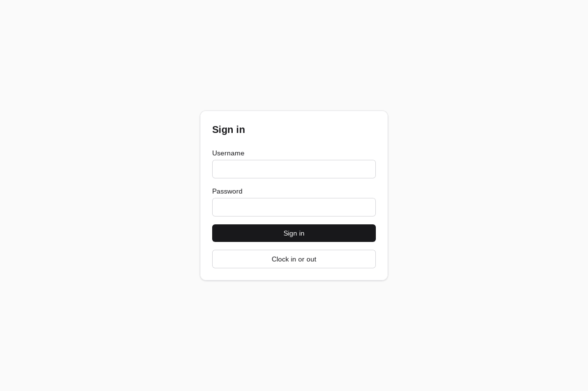

A few rules protect accounts:

- Five wrong passwords lock the account for 15 minutes. The sign-in screen does not say the
  account is locked, so nobody can tell which usernames exist. After 15 minutes the right
  password works again.
- After 15 minutes without activity you are signed out and must sign in again. Admin can change
  the number of minutes in Settings.
- When an Admin creates your account or resets your password, you get a temporary password. The
  first time you sign in with it, Wagecraft asks you to choose your own before it shows anything
  else.
- To change your password later, ask an Admin to reset it. There is no change-password link yet.

### Light and dark

The **Light**, **Dark** and **System** buttons at the top switch the theme. System follows
Windows. The choice is kept on this PC.

### What each role sees

The sidebar only lists the screens your role can open. Opening another screen some other way
shows a short note instead, and the data never leaves the database.

| Screen                                                          | Admin | HR  | Staff |
| --------------------------------------------------------------- | :---: | :-: | :---: |
| Home, My profile, My attendance, My leave, My payslips          |  yes  | yes |  yes  |
| Employees, Attendance, Overtime, Leave, Leave calendar, Payroll |  yes  | yes |       |
| Organization, Holidays                                          |  yes  | yes |       |
| Users, Backups, Settings, Activity                              |  yes  |     |       |

Admin and HR users who are also on the payroll link their account to their employee record
(section 4.4) so the My pages show their own data.

## 2. The time clock

The time clock is the shared screen where employees clock in and out. Open it with **Clock in or
out** on the sign-in screen and leave the PC on it during the day. Nobody needs to sign in.

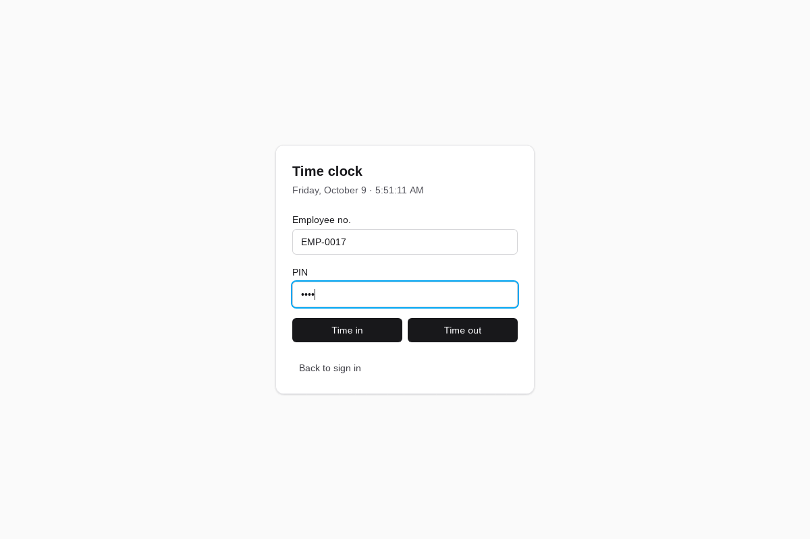

1. Type your employee number, for example `EMP-0017`.
2. Type your PIN. HR sets it on your employee profile (section 4.4); it is 4 to 6 digits.
3. Press **Time in** when you arrive and **Time out** when you leave.

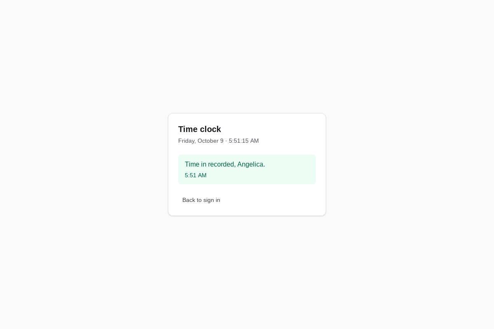

The screen confirms each punch with your first name and the time, and says how many minutes
late a time-in was. It clears the fields for the next person.

- Five wrong PINs lock the time clock for that employee number for 15 minutes. HR can end the
  lock early by setting a new PIN.
- You can't clock in twice for one shift, and you can't clock out before clocking in. If you
  forgot a punch, ask HR to add or correct it (section 4.6).
- Employees who have left the company, or whose records are archived, can't use the clock.

Press **Back to sign in** to return to the sign-in screen.

## 3. For staff

### Home

Home shows your day at a glance: today's punch, this cutoff's days present, late minutes and
approved overtime, the leave you have left this year, your latest payslip, and any requests
still waiting for HR.

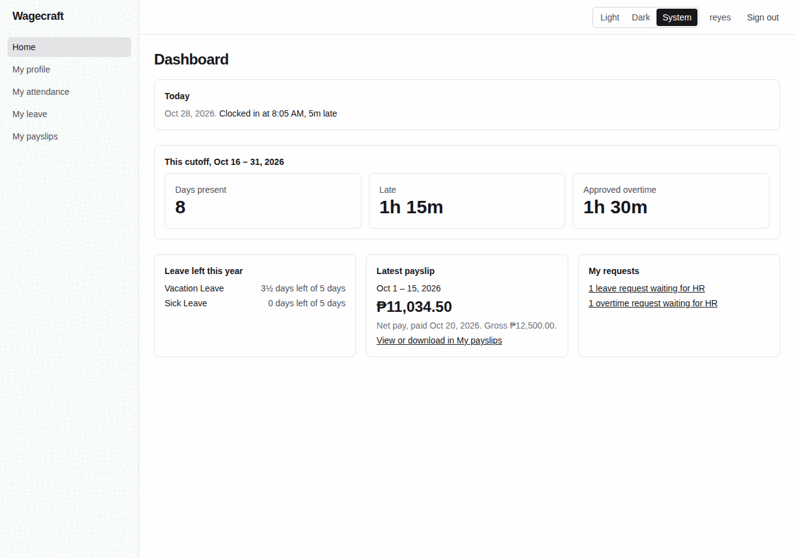

### My profile

My profile shows what HR has on record for you: personal details, employment, government IDs
and pay. It is read-only. If something is wrong, ask HR to change it.

### My attendance

My attendance lists one row per day for the month you pick: time in, time out, minutes late,
undertime, hours worked and night hours. Days without a punch are not listed.

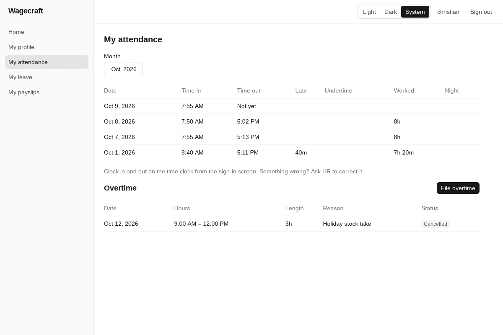

The **Overtime** section below the list is where you file overtime. Press **File overtime**,
enter the date, the start and end times and what it was for. HR decides it; only approved
overtime is paid. You can cancel a request while it is still waiting.

### My leave

**File leave** asks for the leave type, the first and last day, whether it is a half day, and
the reason. The request goes to HR. You can cancel it until HR decides; to take back approved
leave, ask HR.

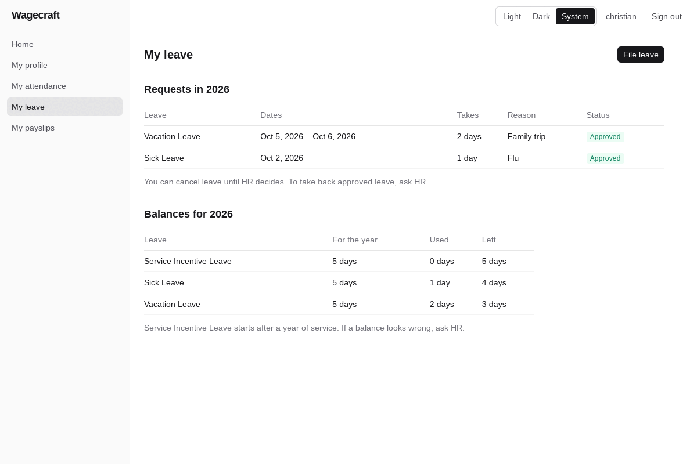

**Balances for the year** shows, for each leave type, the days you get for the year, the days
used and the days left. Approved paid leave takes days from the balance; cancelled leave gives
them back. Service Incentive Leave starts after a year of service.

### My payslips

My payslips lists every payroll that HR has posted with you in it. **View** opens the payslip
under the row: basic pay, overtime and holiday pay, late and absence deductions, SSS, PhilHealth,
Pag-IBIG and withholding tax, the net pay, and the employer's contributions. **Download PDF**
saves a copy with the company name, address, TIN and logo.

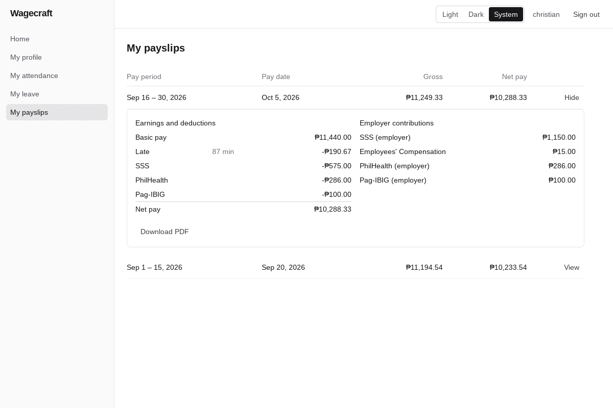

A payroll appears here only after HR posts it (section 4.8), so a period being worked on is not
listed yet.

## 4. For HR and Admin

### 4.1 Home

The dashboard counts the employees and shows how today is going: present, late, not clocked in
and on leave. **Waiting for review** links to the leave and overtime requests that need a
decision. The charts show employees by department and the payroll cost of the last six posted
periods.

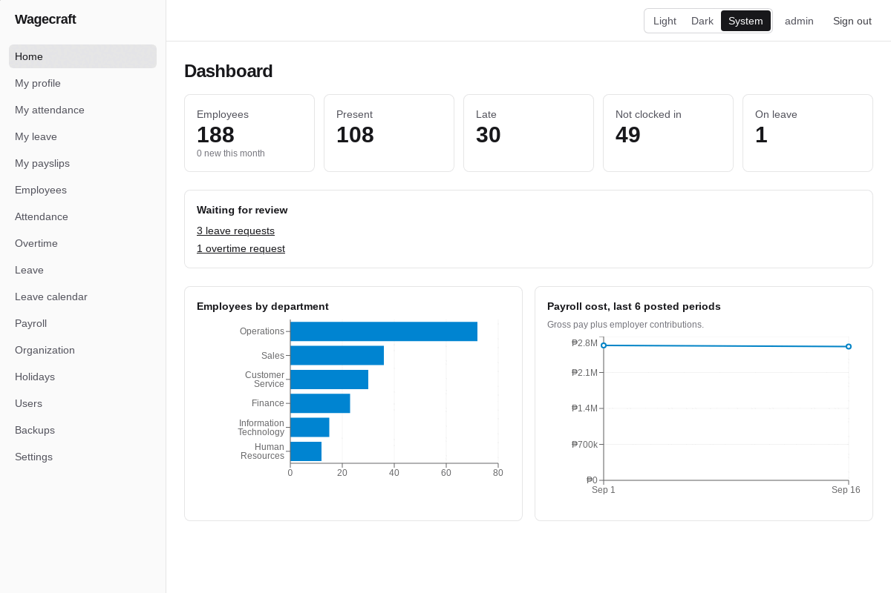

### 4.2 Organization

Organization holds the departments and positions that employees are assigned to.

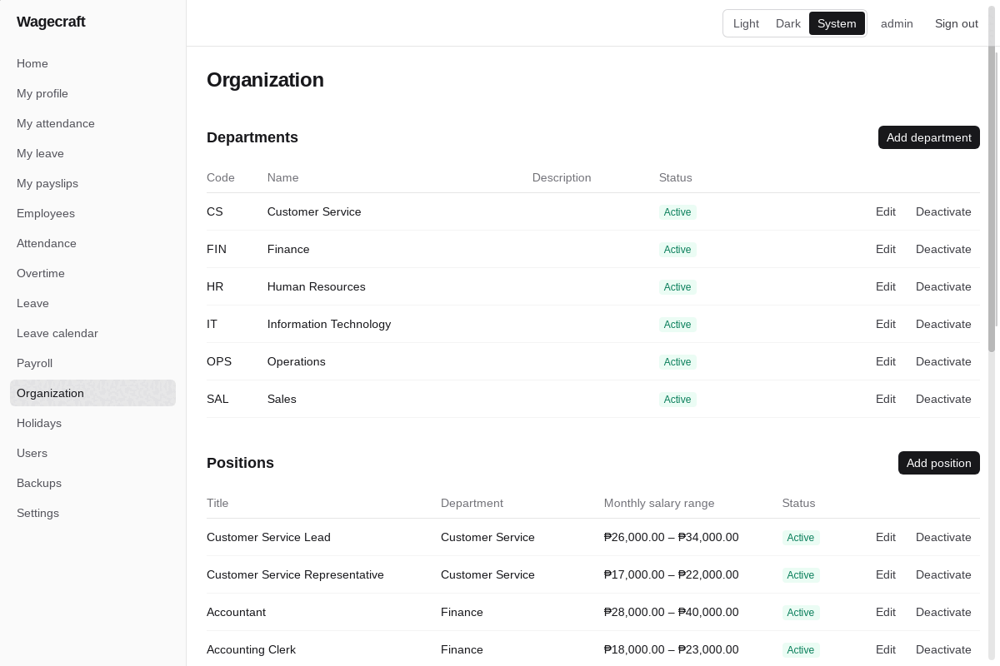

- A **department** has a code, a name and an optional description.
- A **position** belongs to one department and can have a monthly salary range. When an
  employee's monthly rate falls outside the range, the Compensation tab shows a note; it never
  blocks the rate.
- Departments and positions are never deleted. **Deactivate** hides one from the pick lists while
  the employees who have it keep it.

### 4.3 Holidays

Enter each year's holidays from the official proclamation. The type sets the holiday pay:
**Regular holiday**, **Special non-working day** or **Special working day**. For a double holiday,
add both holidays on the same date. Use the arrows next to the year to move between years.

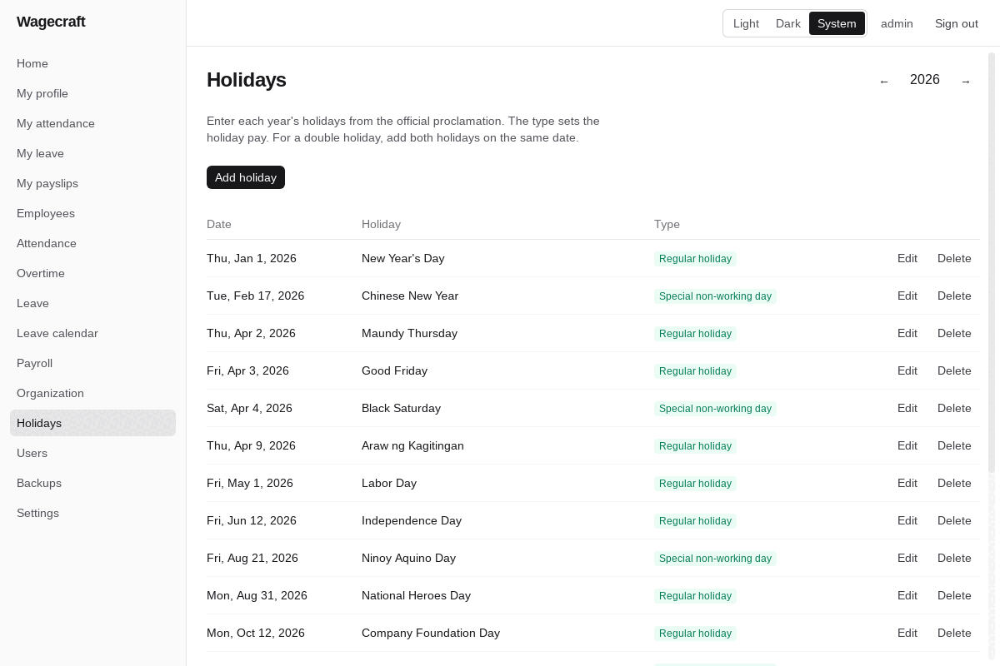

Wagecraft ships with the 2026 Philippine holidays. A holiday that falls in a posted payroll
period can no longer be edited or deleted; the row says **Payroll posted**.

### 4.4 Employees

The Employees screen lists current employees with their number, name, department, position,
status and hire date. Search by number, name or email; filter by department and status; switch
**Show** to see archived employees. **Export CSV** saves the masterlist.

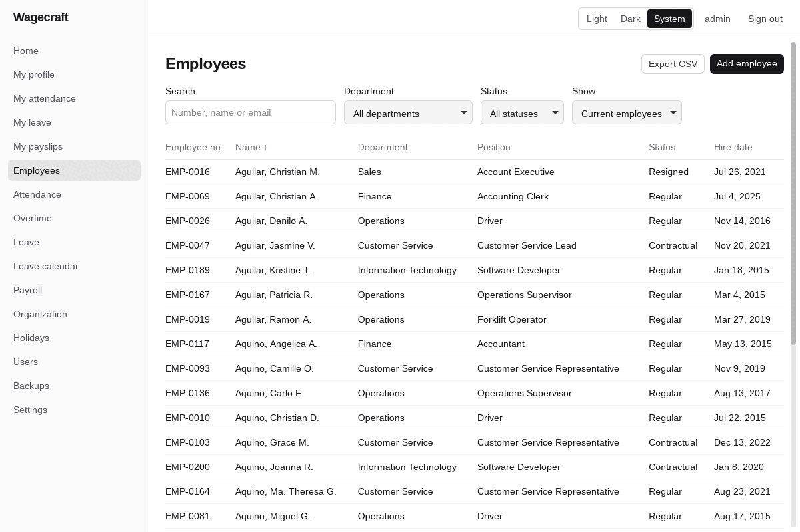

**Add employee** opens the form: name and number, personal details, employment (status, hire,
regularization and separation dates, department, position and work schedule), government IDs
(TIN, SSS, PhilHealth, Pag-IBIG) and bank details. Employment status is one of Probationary,
Regular, Contractual, Resigned or Terminated.

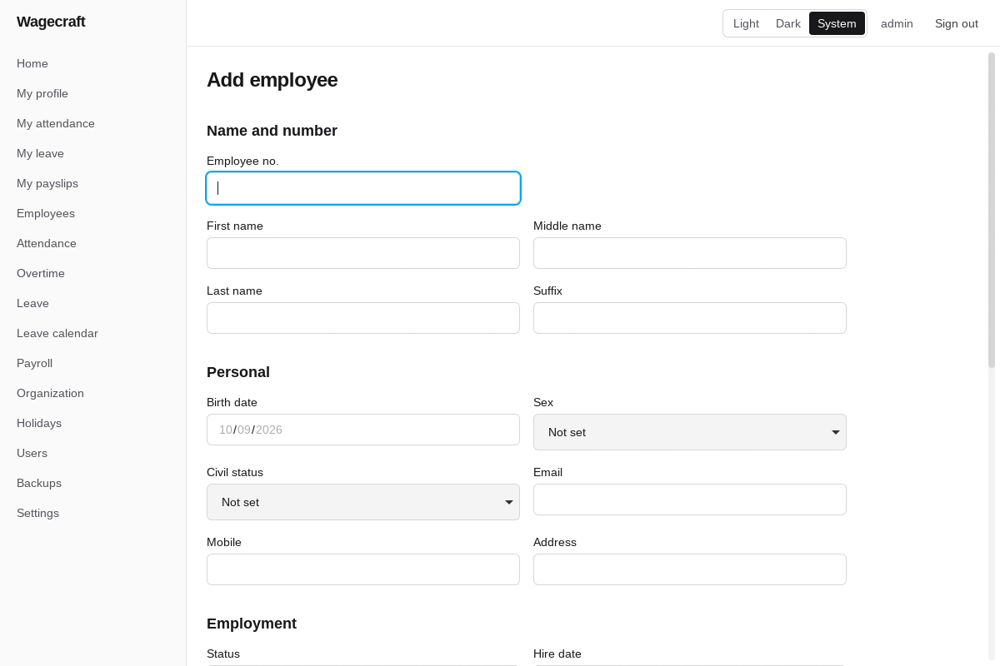

Clicking a row opens the **employee profile**. **Edit** changes the form fields. Once an employee
has a separation date and a Resigned or Terminated status, **Archive** takes them off the lists;
they stay in past payrolls and reports, and **Unarchive** brings them back.

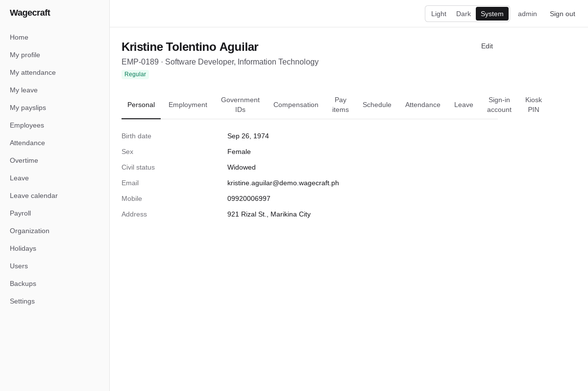

The tabs:

- **Personal**, **Employment** and **Government IDs** show the form fields.
- **Compensation** is the pay history. Every pay change is a new row with a start date; the
  previous rate ends the day before, and payslips already made keep the rate they used. A new rate
  must start on the 1st or the 16th, and can't start inside a period that is already computed.
  Tick **Minimum wage earner** when no tax should be withheld while the rate applies.

  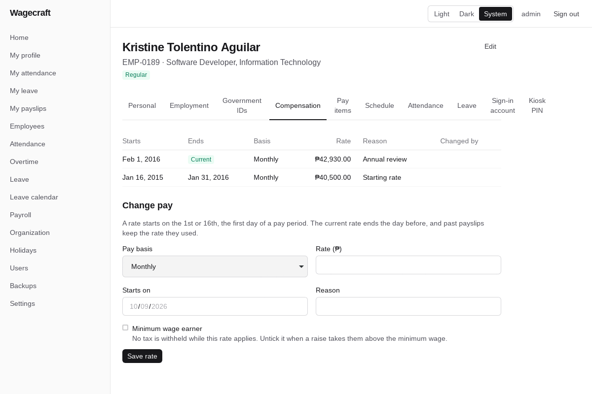

- **Pay items** are recurring allowances, loans and deductions: a name, the amount per cutoff,
  which cutoffs it runs on, start and end dates, and for loans the amount still owed. A loan goes
  down each time a payroll that includes it is posted.
- **Schedule** is the work schedule history. **Change schedule** sets a new schedule from a date,
  with a reason; the old one stays on the days before it.
- **Attendance** and **Leave** show that employee's records.
- **Sign-in account** is where Staff get access. **Create a Staff account** with a username and a
  temporary password; the employee chooses their own password the first time they sign in. An
  Admin or HR user who is on the payroll is linked here instead with **link an existing account**.
  Unlinking a Staff account turns it off, because a Staff account can't work without an employee.
- **Kiosk PIN** sets or replaces the employee's time clock PIN. Setting a new PIN also ends a
  lock caused by wrong PINs.

  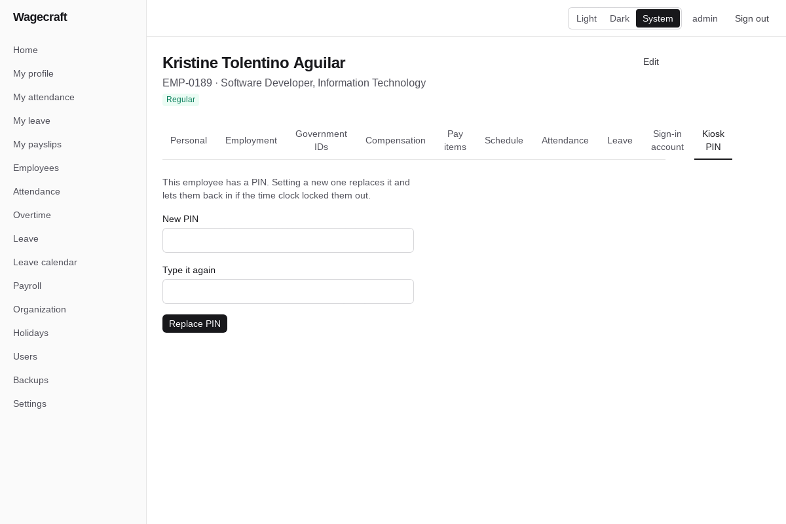

### 4.5 Attendance

Attendance shows one day for everyone: the status, time in and out, minutes late, undertime and
hours worked. Use **Previous day**, **Next day** or the date box to move. The status is worked out
from the punches, the employee's schedule, holidays and approved leave: **Present**, **Absent**,
**On leave**, **Holiday**, **Rest day**, **No schedule**, or **No time in yet** for today.

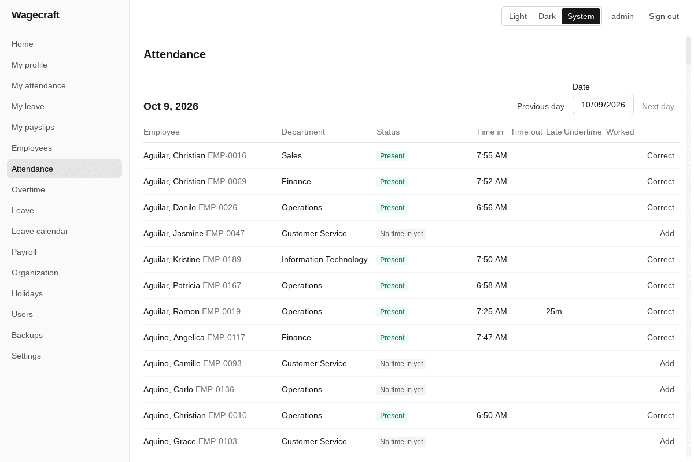

**Add** or **Correct** opens a small form for a day: the time in, the time out and the reason for
the change. Corrected days are marked **Corrected**, and every change is kept in the audit log
with who made it and why.

Days that need a look appear at the top under **Needs review**, for example a punch the PC clock
could not place or a day without a time-out. **Correct** fixes the day; **Mark as reviewed**
accepts it as it is.

Once a payroll is posted, the days in it are locked: "This day is in a posted payroll period, so
it can't be changed."

### 4.6 Overtime

Overtime requests from staff wait here under **Waiting for a decision** with **Approve** and
**Reject**. **All requests** lists the month by status. **File for an employee** files on someone's
behalf, for example from a paper form.

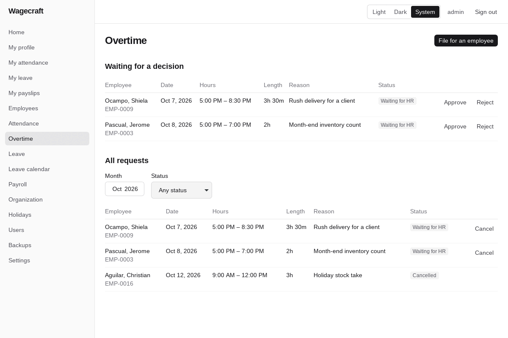

Only approved overtime is paid, at the rates in the rule pack. Nobody can decide their own
request, so an HR user's overtime needs another Admin or HR user.

### 4.7 Leave

Leave requests work the same way: **Approve** or **Reject** what is waiting, see **All requests**
for a month, and **File for an employee** when needed. Approving paid leave takes the days from the
employee's balance, and cancelling approved leave gives them back. Approved leave shows on the
attendance grid as **On leave**; a paid leave type is paid like a normal day.

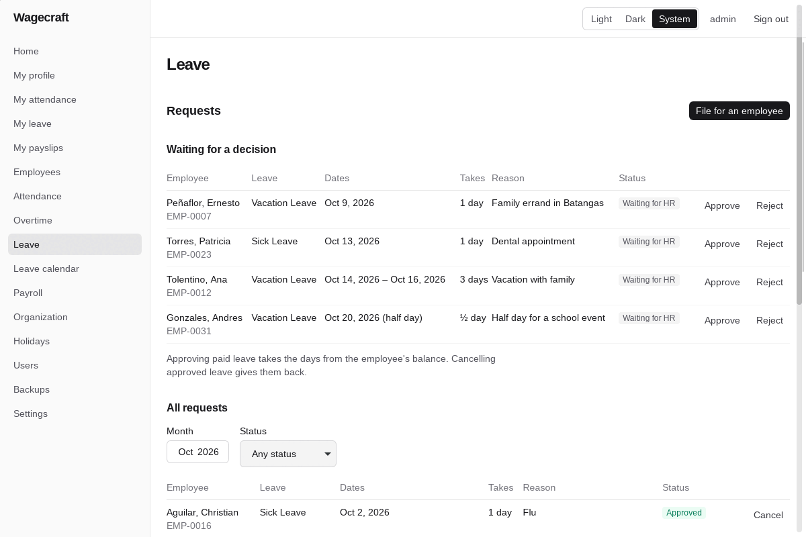

Further down the page:

- **Yearly balances**. **Grant {year} leave** gives every current employee their leave for the
  year. It only adds what is missing, so it is safe to run again, for example to give Service
  Incentive Leave to someone who just reached a year of service. Balances are also added the first
  time anyone looks at them in a new year.
- **Leave types**. Wagecraft starts with Service Incentive Leave, Vacation Leave and Sick Leave.
  Each type has a code, a name, whether it is paid, the days each year, and the months of service
  needed first. Only Admin can change leave types; a type in use can be deactivated, not deleted.

The **Leave calendar** shows the month with approved leave and the requests still waiting (marked
"waiting"), so you can spot days when too many people are out before approving more.

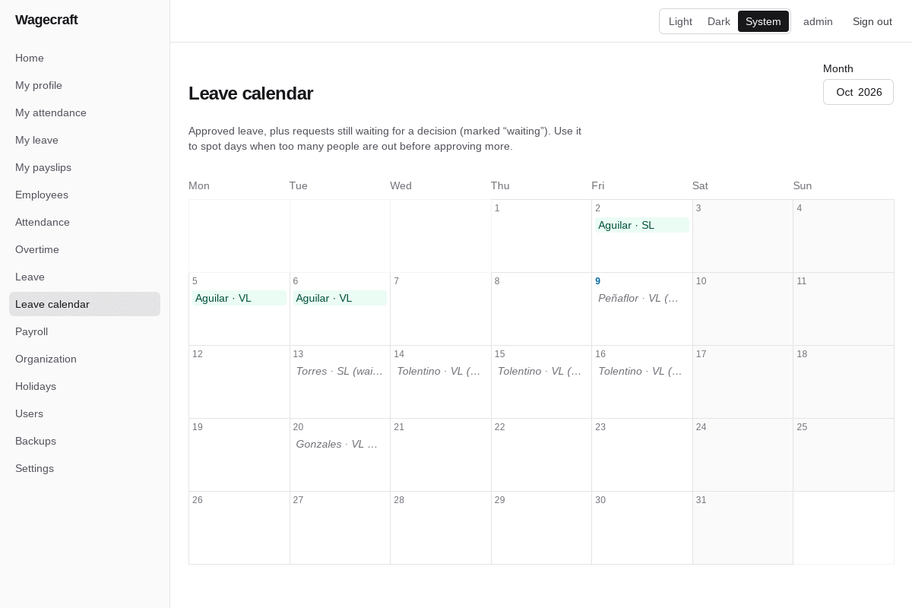

### 4.8 Payroll

Each pay period is one semi-monthly cutoff: the 1st to the 15th, or the 16th to the end of the
month. The steps are **create the period**, **compute**, **approve**, then **post**.

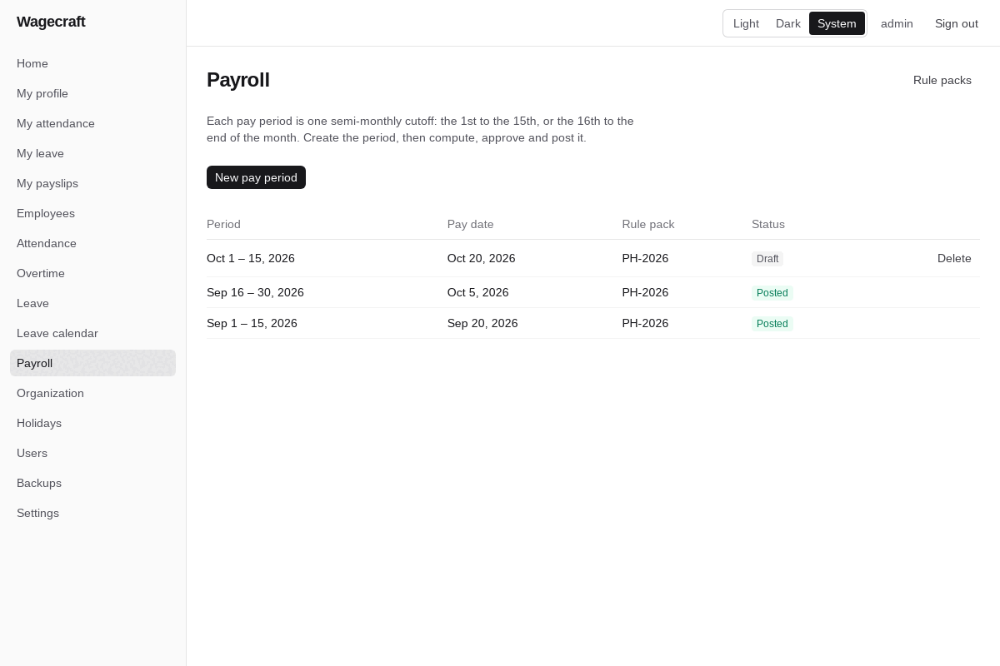

**New pay period** asks for the month, the cutoff, the pay date and the rule pack. When the period
is created, a panel lists unfinished work that would change the payslips: leave and overtime still
waiting for a decision, and days without a time-out. Sort those out before you compute. A draft
period can be deleted.

Open the period to reach the register:

1. **Compute payroll** works out every current employee's payslip from their attendance, approved
   leave and overtime, holidays, pay rate and pay items, under the period's rule pack. The status
   becomes **Computed**. The register lists each employee's gross pay, contributions, tax, other
   deductions and net pay; **View** opens the payslip. Employees with no rate for the period are
   listed under **Not in this payroll** with the reason.

   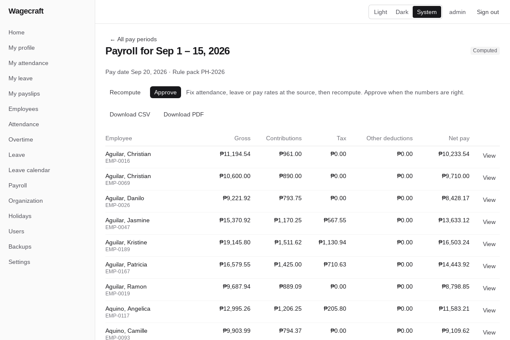

2. Fix anything wrong at the source (attendance, leave, rates, pay items), then **Recompute**.
   **Approve** when the numbers are right. Compute after the cutoff has ended; computing earlier
   counts the remaining days as absences.

3. An approved period can be **sent back** with a reason if something still needs fixing, or
   **posted**. Posting asks you to confirm.

   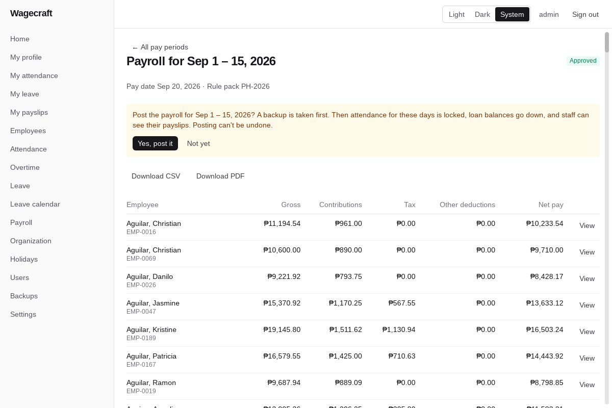

4. **Post** is final. Wagecraft backs up the database first, then locks attendance for the
   period's days, cuts each loan by its scheduled amount, and makes the payslips visible to staff
   under My payslips. Posting can't be undone.

   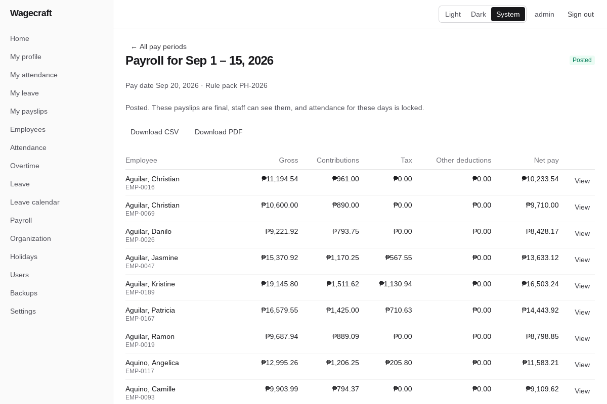

**Download CSV** and **Download PDF** save the payroll register once the period is computed. The
PDF carries the company name, address, TIN and logo from Settings.

**Rule packs** (the link at the top of the Payroll screen) shows the government rates each payroll
is computed with: the daily rate factors, SSS, PhilHealth and Pag-IBIG contributions, the premium
pay for holidays, rest days and night work, and the semi-monthly withholding tax table. They
can't be edited. New rates come as a new pack in an app update, with its own start date, so
payslips already posted keep the rates they were made with.

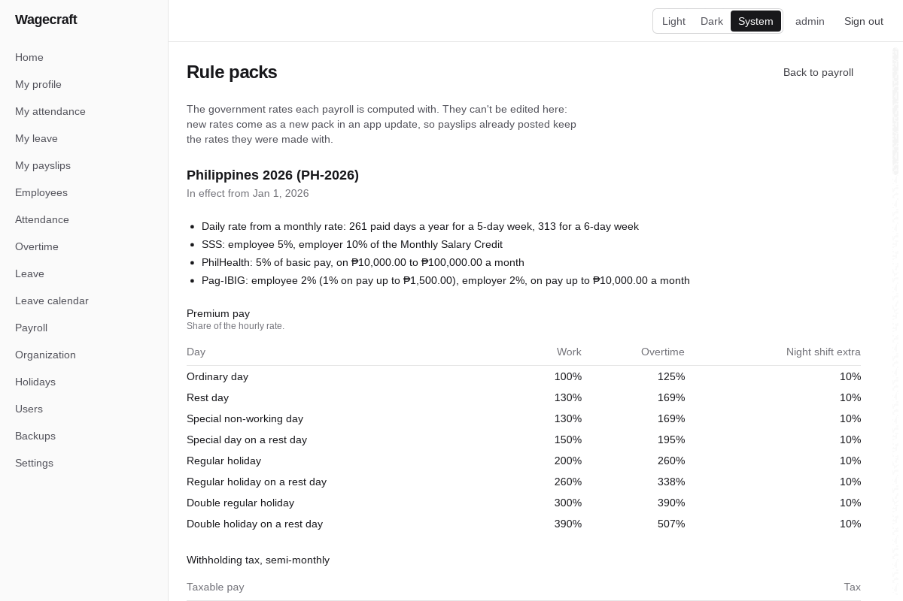

## 5. For Admin

### 5.1 Users

Users lists every account with its role, the linked employee, its status and the last sign-in.

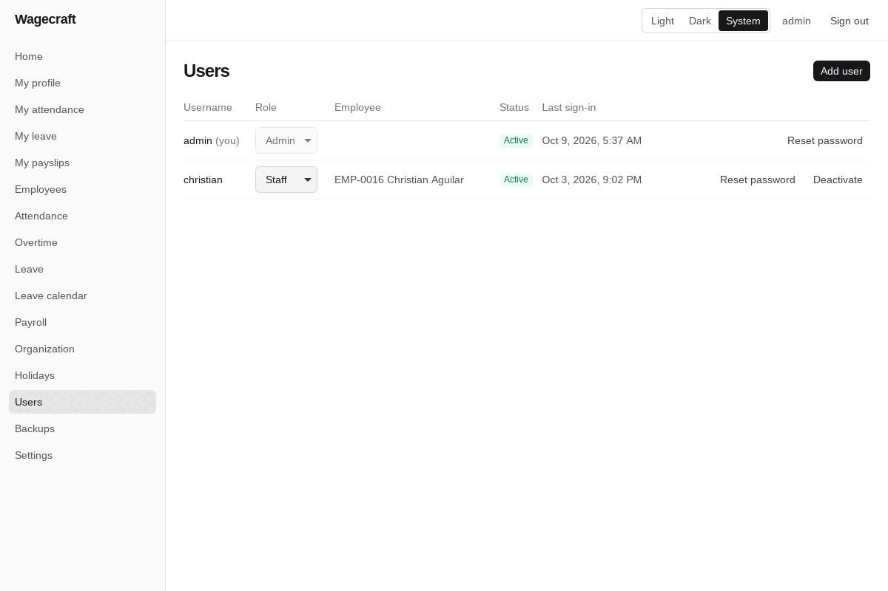

- **Add user** creates an Admin or HR account with a username, a role and a temporary password.
  Staff accounts are created from the employee profile instead (section 4.4), so they are always
  linked to an employee.
- The **Role** box changes a user's role. You can't remove your own Admin role, so the company
  always has at least one Admin.
- **Reset password** gives the user a new temporary password, which they must change at their
  next sign-in.
- **Deactivate** stops an account from signing in without deleting it; **Activate** turns it back
  on. You can't deactivate your own account.
- A **Locked** badge means five wrong passwords in a row; it clears after 15 minutes.

### 5.2 Backups

Wagecraft backs up by itself: once a day when it starts, right before a payroll is posted, and
right before a restore. Daily backups go to the backups folder (the default is inside the app
data folder; change it in Settings), and only the newest 14 are kept. **Back up now** asks where
to save a copy, for example a USB drive, so a broken PC doesn't take the payroll with it.

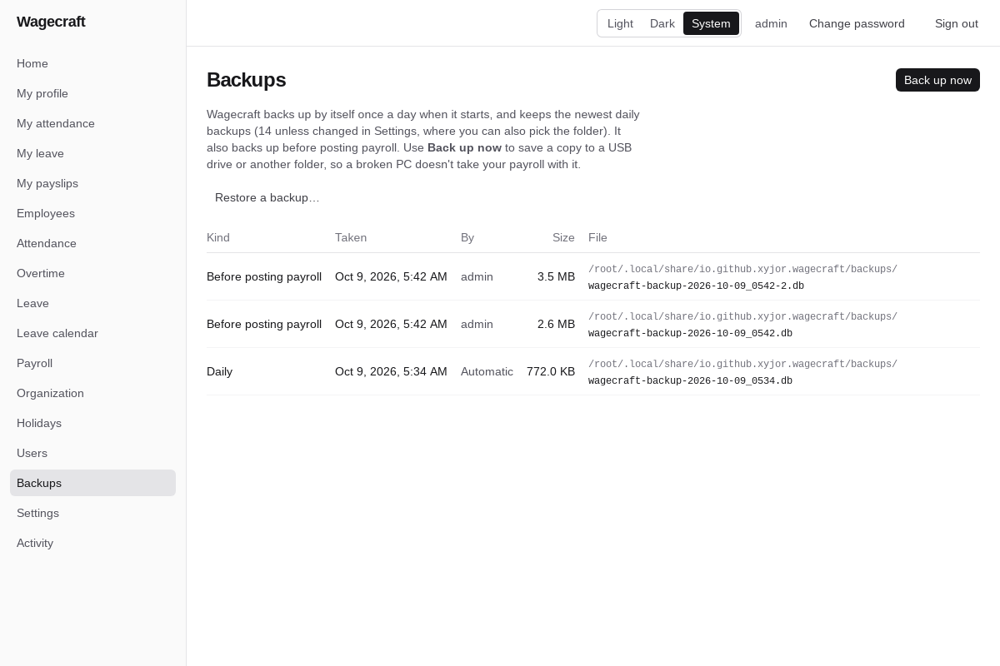

**Restore a backup…** asks for a backup file, then shows what it holds: when it was saved, how many
employees, and the last posted payroll. Everything entered after that backup will be lost. Type
`RESTORE` to confirm. Wagecraft backs up the current data first, replaces the database, restarts,
and everyone signs in again. Restoring is an Admin-only action, and the audit log records it.

### 5.3 Settings

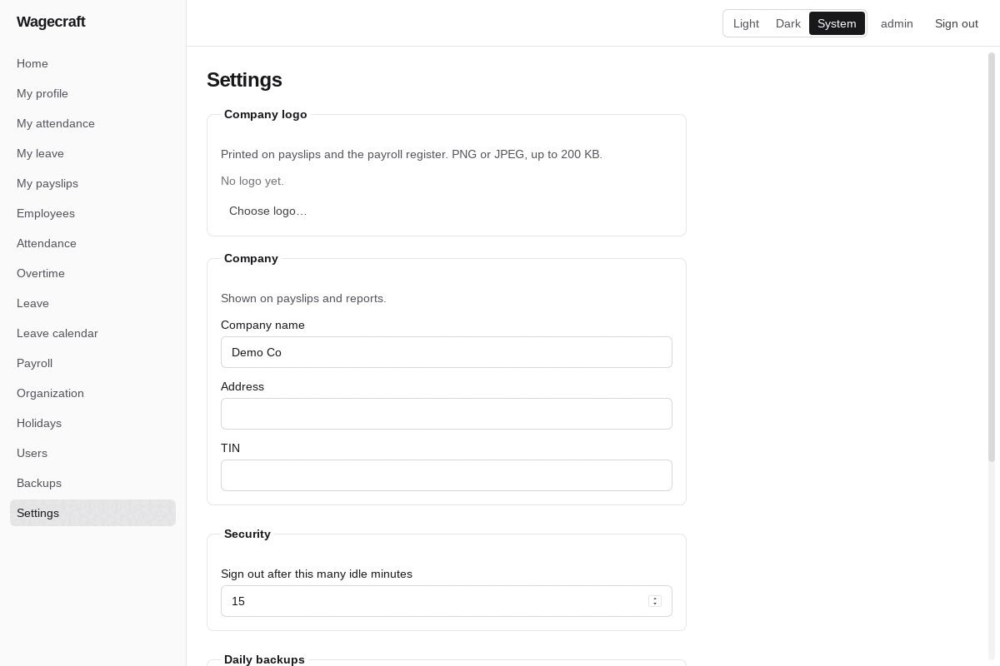

- **Company logo**: a PNG or JPEG up to 200 KB, printed on payslips and the payroll register.
- **Company**: the name, address and TIN shown on payslips and reports.
- **Security**: the idle minutes before a user is signed out.
- **Daily backups**: the folder and how many daily backups to keep.

### 5.4 Activity

Activity is the audit log: every sign-in, failed sign-in and change, newest first, with who did
it and when. Nothing here can be edited or deleted, by anyone. Filter by day, user, action (one
action, or a whole area such as all payroll actions), and record, for example everything that
happened to one employee. **View** on a row shows what changed, field by field, before and
after. **Export CSV** saves the filtered list, and the export itself is logged.

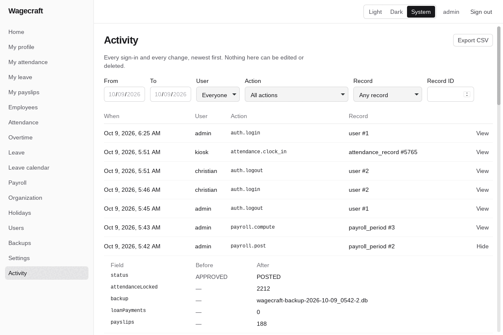

The log records what happens through Wagecraft. It can't see changes made to the database file
by other programs, which is one more reason to keep the PC's user accounts to the people who
run payroll.

## 6. Where the data lives

Everything is in one SQLite file on this PC:
`C:\Users\<you>\AppData\Roaming\io.github.xyjor.wagecraft\wagecraft.db`. Daily backups are in the
`backups` folder next to it unless Settings says otherwise. The app's log is at
`C:\Users\<you>\AppData\Local\io.github.xyjor.wagecraft\logs\Wagecraft.log`. Copy backups to
another drive regularly; the PC is the only place the data exists.

Wagecraft does not use the network. Nothing is sent anywhere.

## 7. Limits of this version

- One PC, one company. There is no server and no second PC.
- Pay is semi-monthly only.
- The rule pack is fixed at PH-2026 until an update brings a new one.
- Users change their password only when an Admin resets it.
