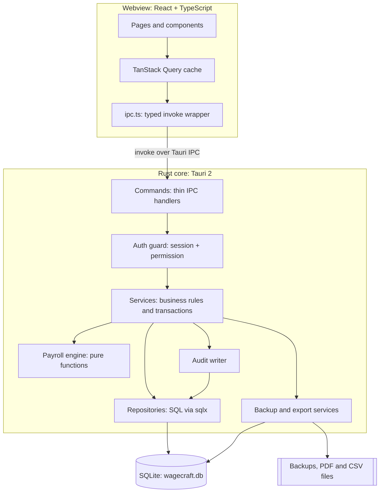
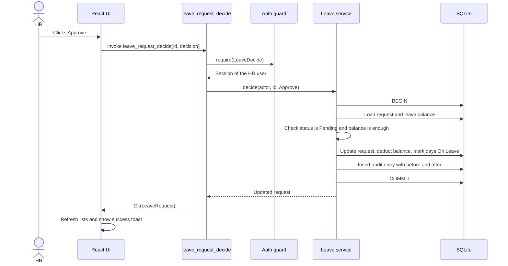
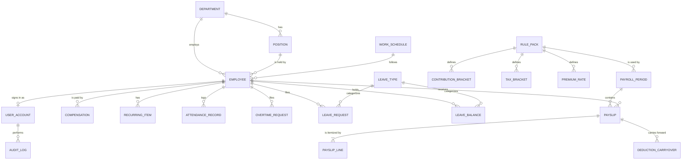
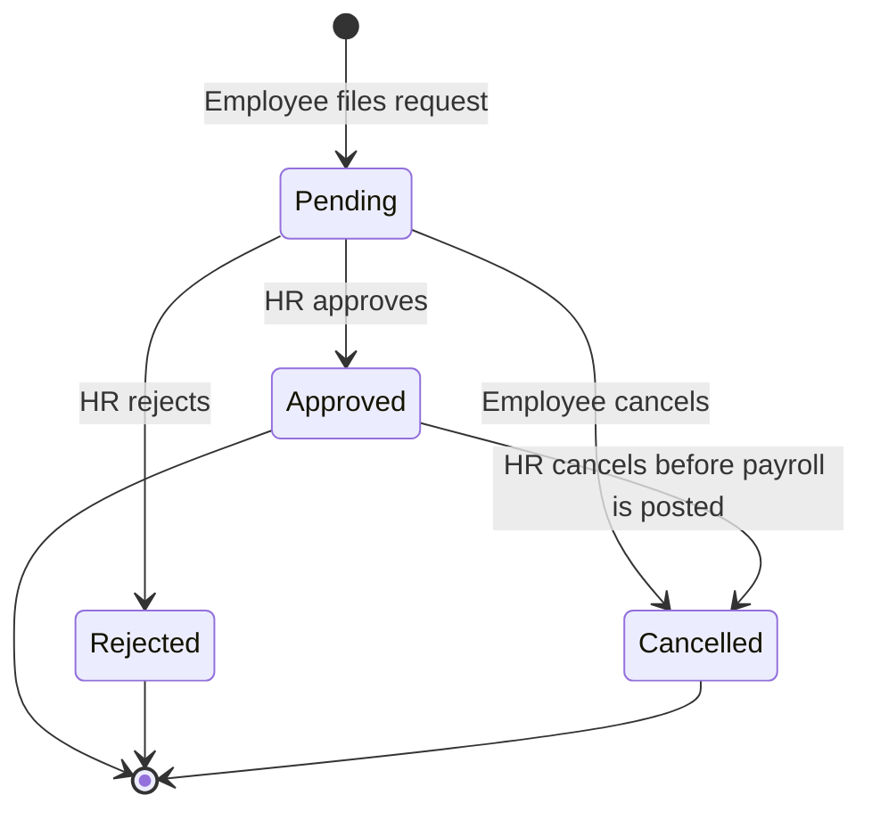
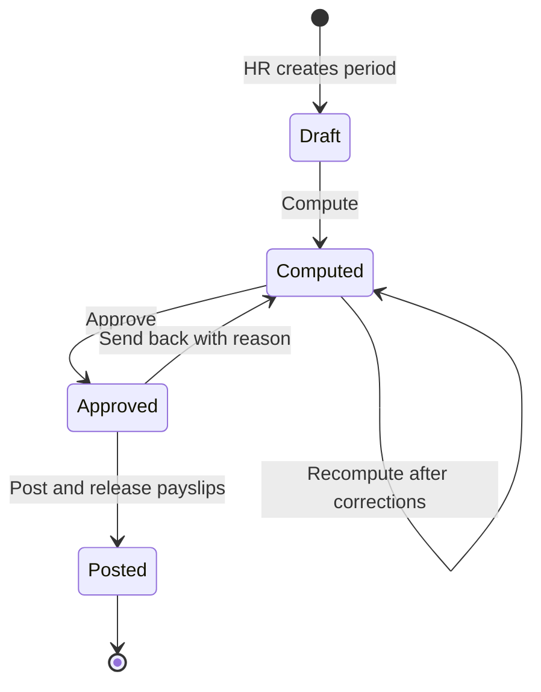
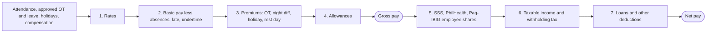
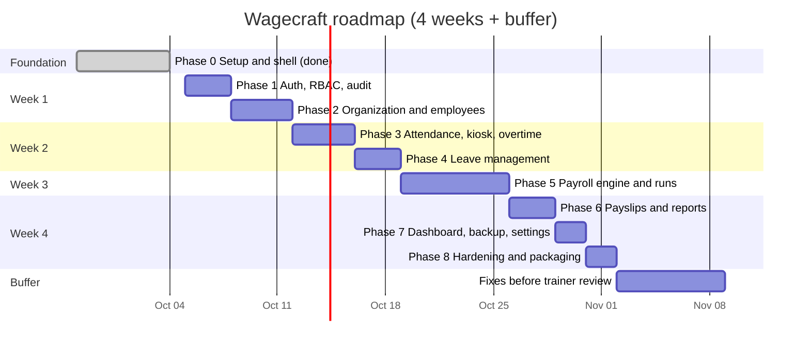

# Wagecraft — Project Plan & Architecture

**Desktop Employee Management & Payroll System built with Tauri 2**

|                        |                                                                   |
| ---------------------- | ----------------------------------------------------------------- |
| **Project name**       | Wagecraft                                                         |
| **Type**               | Offline desktop application (Windows first; macOS/Linux possible) |
| **Core stack**         | Tauri 2 · Rust · SQLite · React + TypeScript                      |
| **Plan version**       | 1.1 — October 3, 2026                                             |
| **Developer**          | _________________                                                 |
| **Trainer / reviewer** | _________________                                                 |
| **Repository**         | `Xyjor/wagecraft`                                        |
| **Duration**           | 4 weeks (Oct 5 – Nov 1, 2026) + 1 buffer week (Nov 2–8); Phase 0 done Oct 3 |

Revised Oct 3, 2026: 4-week timeline to Nov 1 (trainer review in about a month), trimmed v1 scope, decisions owned by the developer.

> **Name check:** a web search on Oct 2, 2026 found no HR, payroll, or time-tracking product called "Wagecraft". That is not a legal trademark search. Before publishing it publicly, also check the IPOPHL trademark database, GitHub, and domain availability.

> **Disclaimer:** Wagecraft is a training project. The payroll rules follow Philippine law as understood in October 2026, but every rate and table must be verified against the official SSS, PhilHealth, Pag-IBIG, BIR, and DOLE issuances before the software is used to pay real people. v1 does not compute 13th-month pay (PD 851); that is a known gap.

---

## Table of Contents

1. [Project Overview](#1-project-overview)
2. [Requirements](#2-requirements)
3. [Roles & Permissions](#3-roles--permissions)
4. [System Architecture](#4-system-architecture)
5. [Data Model](#5-data-model)
6. [Module Designs](#6-module-designs)
7. [Payroll Engine](#7-payroll-engine)
8. [Security Design](#8-security-design)
9. [Architecture Decision Records](#9-architecture-decision-records)
10. [Development Roadmap](#10-development-roadmap)
11. [Testing Strategy](#11-testing-strategy)
12. [Workflow, Conventions & Definition of Done](#12-workflow-conventions--definition-of-done)
13. [Packaging & Release](#13-packaging--release)
14. [Risks & Mitigations](#14-risks--mitigations)
15. [Scope: v1.0 vs Stretch Goals](#15-scope-v10-vs-stretch-goals)
16. [Open Questions for the Trainer](#16-open-questions-for-the-trainer)

- [Appendix A — PH-2026 Rule Pack Seed Values](#appendix-a--ph-2026-rule-pack-seed-values)
- [Appendix B — IPC Command Catalog](#appendix-b--ipc-command-catalog)
- [Appendix C — Glossary](#appendix-c--glossary)

---

## 1. Project Overview

### 1.1 What Wagecraft is

Wagecraft is a desktop app that lets a small or medium business manage employees, track attendance and leave, and run payroll entirely on one computer, without an internet connection or a server. HR staff maintain employee records and run payroll; employees clock in and out, file leave, and download their own payslips; an administrator manages accounts, settings, backups, and the audit trail.

### 1.2 Goals

1. Deliver all 18 required features as a working, installable desktop app.
2. Produce payroll figures that are **correct to the centavo** and reproducible.
3. Learn professional practice along the way: layered architecture, security, testing, version control, and documentation.
4. End with a portfolio-quality repository and a demo-ready installer.

### 1.3 Guiding principles

These principles settle most design arguments before they start:

| #   | Principle                       | What it means in practice                                                                                                                            |
| --- | ------------------------------- | ---------------------------------------------------------------------------------------------------------------------------------------------------- |
| P1  | **Rust owns the truth**         | Business rules, permissions, validation, and money math live in the Rust backend. The React UI is never trusted; it only displays and collects data. |
| P2  | **Money is never a float**      | Amounts are stored as integer centavos and calculated with exact decimals.                                                                           |
| P3  | **Rules are data**              | Contribution tables, tax brackets, and overtime rates live in database tables with effective dates, so a new year's rates need no code change.       |
| P4  | **Every change leaves a trail** | Every create, update, approval, and login writes an audit entry inside the same database transaction.                                                |
| P5  | **Posted payroll is immutable** | Once a payroll period is posted, its payslips and source attendance are locked. Corrections go into the next period as adjustments.                  |
| P6  | **Offline first**               | Everything works with no network. One SQLite file is the single source of data.                                                                      |
| P7  | **Boring technology**           | Prefer well-documented, widely used libraries over clever ones.                                                                                      |

### 1.4 Decisions (owner's decisions — see §16)

The trainer cannot be contacted before the review, so these are the owner's decisions on the questions in §16. The plan is built on them.

- **Q1:** Payroll follows **Philippine rules** (SSS, PhilHealth, Pag-IBIG, BIR withholding tax, DOLE premium pay), packaged as the **PH-2026** rule pack. The rule pack is built last in Phase 5, after the engine works against test fixtures.
- **Q2:** Pay frequency is **semi-monthly only** (1st–15th and 16th–end of month). Monthly payroll is a stretch goal.
- **Q3 + Q4:** The app runs on **one computer**. Multiple PCs sharing data is out of scope for v1 (see ADR-003). Staff clock in and out on a **kiosk screen** with their employee number and a 4–6 digit PIN. The PIN is hashed like a password. Staff sign in with a password only to see their leave and payslips.
- **Q5:** Frontend is **React + TypeScript** (Tauri allows any web framework).
- **Q6:** Admin has all HR permissions. There is no maker–checker rule in v1.
- **Q7:** The payslip layout is the one in §6.6.
- **Q8:** All 18 features by **Nov 1, 2026** (`v1.0.0`), with a buffer week (Nov 2–8) before the trainer's review in about a month. The owner has about 15 hours a week, mostly for reviewing PRs; the AI writes most of the code.
- Primary target OS is **Windows 10/11**.

---

## 2. Requirements

### 2.1 Functional requirements

Every required feature is mapped to a module and a roadmap phase.

| ID   | Required feature                               | Module              | Phase    |
| ---- | ---------------------------------------------- | ------------------- | -------- |
| F-01 | Employee accounts and profiles                 | Employees, Users    | 1–2      |
| F-02 | Departments and job positions                  | Organization        | 2        |
| F-03 | Attendance and time-in/time-out records        | Attendance          | 3        |
| F-04 | Leave request management                       | Leave               | 4        |
| F-05 | Salary and payroll computation                 | Payroll             | 5        |
| F-06 | Overtime and deductions                        | Attendance, Payroll | 3, 5     |
| F-07 | Payslip generation                             | Reports             | 6        |
| F-08 | Employee search and filtering                  | Employees           | 2        |
| F-09 | Role-based access for Admin / HR / Staff       | Auth                | 1        |
| F-10 | Local database                                 | Core                | 0        |
| F-11 | Backup and restore                             | System              | 7        |
| F-12 | Export payroll reports to PDF/CSV              | Reports             | 6        |
| F-13 | Audit/activity logs                            | Audit               | 1, 7     |
| F-14 | Dashboard with employee and payroll statistics | Dashboard           | 7        |
| F-15 | Secure login                                   | Auth                | 1        |
| F-16 | Dark/light mode                                | UI shell            | 0        |
| F-17 | Automatic data validation                      | All modules         | 2 onward |
| F-18 | Tauri desktop packaging                        | Release             | 8        |

### 2.2 Non-functional requirements

| Category            | Target                                                                                                                                                       |
| ------------------- | ------------------------------------------------------------------------------------------------------------------------------------------------------------ |
| **Data volume**     | Tested with 200 employees and 1 year of attendance history (≈50,000 attendance rows) without noticeable slowdown.                                            |
| **Performance**     | Any screen loads in < 1 s; employee search returns in < 200 ms; computing payroll for 200 employees takes < 5 s.                                             |
| **Startup**         | Cold start to login screen in < 3 s on a mid-range laptop.                                                                                                   |
| **Reliability**     | No data loss on crash or power cut (SQLite WAL + transactions). Recovery point ≤ 24 h through automatic daily backups; restore takes < 15 min.               |
| **Correctness**     | 20 reviewed "golden" payroll cases must pass before every release. Test coverage is tracked but is not a gate.                                               |
| **Security**        | Argon2id password hashing, account lockout, idle auto-logout, permission checks on every backend command, append-only audit log, minimal Tauri capabilities. |
| **Privacy**         | Government ID numbers and salaries are visible only to roles that need them; they are never written to log files.                                            |
| **Usability**       | Dark/light/system themes; inline validation messages; every list supports search, filter, sort, and pagination; usable by keyboard.                          |
| **Maintainability** | CI runs formatting, lint, tests, and a build on every pull request; code is layered so business logic is testable without the UI.                            |
| **Portability**     | Windows NSIS installer only in v1; the code stays OS-agnostic so macOS and Linux builds remain possible.                                                    |

### 2.3 Constraints

- Must use **Tauri** (trainer requirement).
- Must use a **local database** with no external server.
- One developer (the owner), who reviews about one PR a day; the AI writes most of the code. The trainer reviews the finished app.
- 4 weeks to v1.0.0 (Oct 5 to Nov 1, 2026), plus a buffer week (Nov 2–8) before the trainer's review. The owner has about 15 hours a week; the schedule is set by the review date, not derived from those hours.

---

## 3. Roles & Permissions

### 3.1 Roles

| Role      | Who                   | Purpose                                                                                                      |
| --------- | --------------------- | ------------------------------------------------------------------------------------------------------------ |
| **Admin** | Owner or IT person    | Manages user accounts, system settings, rule packs, backups, and the audit log. Has every HR permission too. |
| **HR**    | HR or payroll officer | Manages employees, organization, attendance corrections, leave approvals, and payroll runs.                  |
| **Staff** | Regular employee      | Self-service only: own profile, own attendance, leave requests, own payslips. Clocks in and out on the kiosk screen. |

A user account may be linked to one employee record. Staff accounts **must** be linked; Admin and HR accounts usually are.

**Kiosk.** Staff clock in and out on a kiosk screen opened from the login screen. They type their employee number and a 4–6 digit PIN. The kiosk does not create a session; each punch is checked and recorded on its own. Staff sign in with a password only to see their leave and payslips.

### 3.2 Permission matrix

Permissions are defined once in Rust as an `enum Permission` and each role maps to a fixed set. The UI hides buttons a role cannot use, but the **backend check is the real one**.

| Permission                                                         | Admin |  HR  | Staff |
| ------------------------------------------------------------------ | :---: | :--: | :---: |
| `user.manage` — create users, assign roles, reset passwords        |  ✅   |      |       |
| `settings.manage` — company profile, view rule packs, security settings |  ✅   |      |       |
| `backup.manage` — backup and restore                               |  ✅   |      |       |
| `audit.read` — view and export the audit log                       |  ✅   |      |       |
| `org.manage` — departments, positions, schedules, holidays         |  ✅   |  ✅  |       |
| `employee.read_all`                                                |  ✅   |  ✅  |       |
| `employee.write` — create, edit, archive, compensation             |  ✅   |  ✅  |       |
| `attendance.read_all` / `attendance.edit`                          |  ✅   |  ✅  |       |
| `overtime.decide` / `leave.decide` — approve or reject             |  ✅   |  ✅  |       |
| `payroll.compute` — create periods, compute, recompute             |  ✅   |  ✅  |       |
| `payroll.approve` / `payroll.post`                                 |  ✅   |  ✅  |       |
| `payslip.read_all` / `report.export`                               |  ✅   |  ✅  |       |
| `self.profile` — view own profile, change own password             |  ✅   |  ✅  |  ✅   |
| `self.attendance` — view own records, file OT                      |  ✅   |  ✅  |  ✅   |
| `self.leave` — file and cancel own leave                           |  ✅   |  ✅  |  ✅   |
| `self.payslip` — view and download own payslips                    |  ✅   |  ✅  |  ✅   |

Clocking in and out needs no session: the kiosk checks the employee number and PIN instead (§6.3).

There is no maker–checker rule in v1: the person who computed a payroll may also approve it. Maker–checker is a stretch goal (§15).

### 3.3 Row-level rule for Staff

"Self" commands never accept an `employee_id` from the frontend. The backend always uses the `employee_id` stored in the signed-in session. This makes it impossible for a Staff user to read someone else's payslip by editing a request.

---

## 4. System Architecture

### 4.1 Technology stack

| Layer                 | Choice                                                                           | Why                                                                                    |
| --------------------- | -------------------------------------------------------------------------------- | -------------------------------------------------------------------------------------- |
| Desktop shell         | **Tauri 2** (latest 2.x)                                                         | Small installers, low memory use, Rust backend, permission-based security model.       |
| Backend language      | **Rust** (stable)                                                                | Memory-safe and fast, with strong types that catch mistakes at compile time.           |
| Database              | **SQLite** (bundled)                                                             | Single-file, zero-setup embedded database with full transactions.                      |
| DB access             | **sqlx** (SQLite feature) + `sqlx::migrate!`                                     | Async, plain SQL (good for learning), built-in migrations. Runtime `sqlx::query_as` with `#[derive(FromRow)]`, not the `query!` macros. |
| Money math            | **rust_decimal** (+ `rust_decimal_macros`)                                       | Exact decimal arithmetic with explicit rounding strategies.                            |
| Dates/times           | **chrono**                                                                       | Mature date, time, and duration handling.                                              |
| Passwords             | **argon2** (Argon2id)                                                            | Current best practice for password hashing.                                            |
| Errors                | **thiserror** (library code), **anyhow** (startup code)                          | Clear, typed errors.                                                                   |
| CSV                   | **csv** crate                                                                    | Correct quoting and escaping.                                                          |
| TS type generation    | **ts-rs**                                                                        | Generates TypeScript types from Rust structs, so the frontend and backend never drift. |
| Tauri plugins         | `tauri-plugin-dialog`, `tauri-plugin-log`                                        | Native open/save dialogs (called from Rust) and file logging.                          |
| Frontend              | **React 19 + TypeScript + Vite**                                                 | Largest ecosystem and the most learning resources.                                     |
| Routing               | **React Router**                                                                 | Standard client-side routing.                                                          |
| Server state          | **TanStack Query**                                                               | Caching, loading and error states, and refetching for backend calls.                   |
| Forms & validation    | **React Hook Form + Zod**                                                        | Fast forms with schema validation that mirrors the backend rules.                      |
| UI kit                | **Tailwind CSS + shadcn/ui**                                                     | Accessible components with built-in dark mode support.                                 |
| Tables                | **TanStack Table**                                                               | Sorting, filtering, and pagination for data grids.                                     |
| Charts                | **Recharts**                                                                     | Simple React charts for the dashboard.                                                 |
| PDF                   | **@react-pdf/renderer**                                                          | Payslip and report templates written as React components.                              |
| Testing               | `cargo test`, **Vitest** + React Testing Library, a written manual test script   | Unit and integration tests; the critical flows (§11.3) are checked by hand.            |
| Tooling               | pnpm, ESLint, Prettier, rustfmt, clippy, GitHub Actions (`tauri-action`)         | Consistent code and automated checks.                                                  |

### 4.2 High-level architecture



**How it works in one paragraph:** the React UI never touches the database. It calls named Rust commands through Tauri's IPC bridge (`invoke`). Each command first asks the auth guard whether a user is signed in and holds the required permission, then hands off to a service. Services hold the business rules: they validate input, open a database transaction, call repositories (which contain only SQL), write an audit entry, and commit. The payroll engine is a set of pure functions with no database or file access, so it can be tested with nothing but inputs and expected outputs.

### 4.3 Backend layers and their rules

| Layer            | Folder                        | Allowed to                                                                                      | Not allowed to                  |
| ---------------- | ----------------------------- | ----------------------------------------------------------------------------------------------- | ------------------------------- |
| **Commands**     | `src-tauri/src/commands/`     | Deserialize input, call the auth guard, call one service function, return `Result<T, AppError>` | Contain business logic or SQL   |
| **Auth**         | `src-tauri/src/auth/`         | Hold the current session, check permissions, hash and verify passwords                          | Know about employees or payroll |
| **Services**     | `src-tauri/src/services/`     | Validate, open transactions, call repositories, call the engine, write audit entries            | Know about Tauri or the UI      |
| **Domain**       | `src-tauri/src/domain/`       | Models, validation rules, attendance math, payroll engine (pure functions)                      | Do any I/O (DB, files, clock)   |
| **Repositories** | `src-tauri/src/repositories/` | Run parameterized SQL, map rows to structs                                                      | Make business decisions         |

The domain layer does not read the system clock. The current time is passed in as a parameter, which keeps tests deterministic.

### 4.4 Request lifecycle example: HR approves a leave request



If any step fails, the transaction rolls back and nothing is half-saved, including the audit entry.

### 4.5 Project folder structure

```text
wagecraft/
├── .github/workflows/ci.yml          # lint + test + build on every PR
├── docs/
│   ├── adr/                          # one markdown file per decision (§9)
│   ├── user-manual.md
│   └── wagecraft-plan.md             # this document
├── src/                              # ── React frontend ──
│   ├── main.tsx
│   ├── app/
│   │   ├── App.tsx
│   │   ├── router.tsx                # routes + role-based route guards (UX only)
│   │   └── providers.tsx             # QueryClient, ThemeProvider, AuthProvider
│   ├── components/
│   │   ├── ui/                       # shadcn/ui primitives (Button, Dialog, …)
│   │   └── layout/                   # Sidebar, Topbar, PageHeader, ThemeToggle
│   ├── features/
│   │   ├── auth/                     # LoginPage, SetupWizard, ChangePassword
│   │   ├── dashboard/
│   │   ├── organization/             # departments, positions, schedules, holidays
│   │   ├── employees/
│   │   │   ├── api.ts                # invoke wrappers
│   │   │   ├── hooks.ts              # useEmployees, useEmployee, mutations
│   │   │   ├── schemas.ts            # Zod schemas (mirror Rust validation)
│   │   │   ├── components/
│   │   │   └── pages/
│   │   ├── attendance/
│   │   ├── leave/
│   │   ├── payroll/
│   │   ├── reports/                  # PDF templates live here
│   │   ├── audit/
│   │   └── settings/                 # users, backups, rule packs, company profile
│   ├── lib/
│   │   ├── ipc.ts                    # call<T>() + AppError mapping
│   │   ├── money.ts                  # centavos <-> "₱12,500.00"
│   │   └── dates.ts
│   └── bindings/                     # TS types generated by ts-rs (do not edit)
├── src-tauri/                        # ── Rust backend ──
│   ├── Cargo.toml
│   ├── tauri.conf.json
│   ├── capabilities/default.json     # minimal frontend permissions
│   ├── icons/
│   ├── migrations/                   # 0001_core.sql, 0002_attendance.sql, …
│   ├── seeds/                        # PH-2026 rule pack, leave types, demo data
│   ├── tests/
│   │   ├── payroll_cases/            # golden JSON test cases
│   │   ├── rbac.rs                   # every role vs every command
│   │   └── services.rs               # integration tests on in-memory SQLite
│   └── src/
│       ├── main.rs                   # calls wagecraft_lib::run()
│       ├── lib.rs                    # builder: plugins, state, command list
│       ├── state.rs                  # AppState { db, auth }
│       ├── error.rs                  # AppError (serializable to the UI)
│       ├── db.rs                     # pool, PRAGMAs, migrations
│       ├── audit.rs
│       ├── backup.rs
│       ├── auth/        { session.rs, permissions.rs, password.rs }
│       ├── commands/    { auth.rs, employees.rs, attendance.rs, leave.rs, payroll.rs, … }
│       ├── services/    { same modules as commands }
│       ├── repositories/{ same modules as commands }
│       ├── domain/
│       │   ├── models.rs
│       │   ├── validation.rs
│       │   ├── attendance_calc.rs
│       │   └── payroll/ { engine.rs, rates.rs, premiums.rs, contributions.rs, tax.rs, rules.rs }
│       └── export/      { csv.rs, files.rs }
├── package.json
└── README.md
```

### 4.6 IPC conventions

1. **Command names** use `module_action` in snake_case, for example `employee_list`, `payroll_compute`, `leave_request_decide`.
2. **Every command** returns `Result<T, AppError>`. Errors reach the UI as `{ code, message, fields? }`.
3. **List commands** take a query object `{ search, filters, sort, page, pageSize }` and return `{ items, total, page, pageSize }`.
4. **Sort columns** are matched against an allow-list. They are never inserted directly into SQL.
5. **Money** crosses IPC as integer centavos (`i64` in Rust, `number` in TypeScript). It is formatted only at display time. ts-rs turns `i64` into `bigint` by default, so money and other `i64` fields carry `#[ts(type = "number")]`.
6. **Dates** cross IPC as ISO strings: `"2026-10-16"` for dates and `"2026-10-16T08:03:00"` for local date-times.

### 4.7 Code skeletons

**Startup and database** (`src-tauri/src/lib.rs`, `db.rs`)

```rust
// lib.rs
use tauri::Manager;

pub fn run() {
    tauri::Builder::default()
        .plugin(tauri_plugin_dialog::init())
        .plugin(tauri_plugin_log::Builder::new().build())
        .setup(|app| {
            let handle = app.handle().clone();
            let pool = tauri::async_runtime::block_on(db::connect(&handle))?;
            app.manage(AppState::new(pool));
            Ok(())
        })
        .invoke_handler(tauri::generate_handler![
            commands::auth::auth_login,
            commands::auth::auth_logout,
            commands::employees::employee_list,
            commands::employees::employee_update,
            // … every command is registered here (see Appendix B)
        ])
        .run(tauri::generate_context!())
        .expect("error while running Wagecraft");
}
```

```rust
// db.rs
use sqlx::sqlite::{SqliteConnectOptions, SqliteJournalMode, SqlitePoolOptions, SqliteSynchronous};
use std::time::Duration;
use tauri::{AppHandle, Manager};

pub async fn connect(app: &AppHandle) -> anyhow::Result<sqlx::SqlitePool> {
    let dir = app.path().app_data_dir()?;
    std::fs::create_dir_all(&dir)?;

    let options = SqliteConnectOptions::new()
        .filename(dir.join("wagecraft.db"))
        .create_if_missing(true)
        .journal_mode(SqliteJournalMode::Wal)      // crash-safe, readers don't block writers
        .synchronous(SqliteSynchronous::Normal)
        .foreign_keys(true)
        .busy_timeout(Duration::from_secs(5));

    let pool = SqlitePoolOptions::new()
        .max_connections(1) // One connection: Wagecraft has one user at a time, and this rules out SQLITE_BUSY.
        .connect_with(options)
        .await?;

    sqlx::migrate!("./migrations").run(&pool).await?;   // brings any DB up to date
    Ok(pool)
}
```

Queries use runtime `sqlx::query_as` with `#[derive(FromRow)]` structs, not the `query!` / `query_as!` macros. That means no `DATABASE_URL` at build time and no `cargo sqlx prepare` step.

**A read command and a write command** (`commands/employees.rs`)

```rust
#[tauri::command]
pub async fn employee_list(
    state: tauri::State<'_, AppState>,
    query: EmployeeQuery,
) -> Result<Page<EmployeeSummary>, AppError> {
    state.auth.require(Permission::EmployeeReadAll)?;
    employee_service::list(&state.db, &query).await
}

#[tauri::command]
pub async fn employee_update(
    state: tauri::State<'_, AppState>,
    id: i64,
    input: EmployeeInput,
) -> Result<Employee, AppError> {
    let actor = state.auth.require(Permission::EmployeeWrite)?;
    employee_service::update(&state.db, &actor, id, input).await
}
```

**The service does the real work** (`services/employees.rs`)

```rust
pub async fn update(
    db: &SqlitePool,
    actor: &Session,
    id: i64,
    input: EmployeeInput,
) -> Result<Employee, AppError> {
    input.validate()?;                                   // authoritative validation

    let mut tx = db.begin().await?;
    let before = employee_repo::get(&mut *tx, id)
        .await?
        .ok_or(AppError::NotFound("Employee"))?;
    employee_repo::ensure_unique_ids(&mut *tx, id, &input).await?;  // TIN, SSS, etc.
    let after = employee_repo::update(&mut *tx, id, &input).await?;
    audit::record(&mut *tx, actor, "employee.update", "employee", id, Some(&before), Some(&after)).await?;
    tx.commit().await?;

    Ok(after)
}
```

**One error type for the whole backend** (`error.rs`)

```rust
#[derive(Debug, thiserror::Error)]
pub enum AppError {
    #[error("Please sign in")]                         Unauthenticated,
    #[error("Your session expired. Please sign in again")] SessionExpired,
    #[error("You don't have permission to do this")]   Forbidden,
    #[error("Some fields are invalid")]                Validation(Vec<FieldError>),
    #[error("{0} not found")]                          NotFound(&'static str),
    #[error("{0}")]                                    Conflict(String),
    #[error("Something went wrong. Please try again")] Database(#[from] sqlx::Error),
}
// Implement serde::Serialize manually so the UI receives { code, message, fields }.
// Database errors are logged in full but shown to the user only as the generic message.
```

**Frontend wrapper and hook** (`src/lib/ipc.ts`, `src/features/employees/`)

```ts
// lib/ipc.ts
import { invoke } from "@tauri-apps/api/core";

export type AppError = { code: string; message: string; fields?: Record<string, string> };

export async function call<T>(cmd: string, args?: Record<string, unknown>): Promise<T> {
  try {
    return await invoke<T>(cmd, args);
  } catch (e) {
    throw e as AppError; // Rust serializes AppError into this shape
  }
}

// features/employees/api.ts
export const listEmployees = (query: EmployeeQuery) =>
  call<Page<EmployeeSummary>>("employee_list", { query });

// features/employees/hooks.ts
export function useEmployees(query: EmployeeQuery) {
  return useQuery({ queryKey: ["employees", query], queryFn: () => listEmployees(query) });
}
```

---

## 5. Data Model

### 5.1 Database conventions

| Rule                                                                                                                  | Example                                  |
| --------------------------------------------------------------------------------------------------------------------- | ---------------------------------------- |
| Table and column names in `snake_case`, tables plural                                                                 | `attendance_records.work_date`           |
| Primary key `id INTEGER PRIMARY KEY`                                                                                  |                                          |
| Money in **integer centavos** with a `_cents` suffix                                                                  | `rate_cents = 2500000` means ₱25,000.00  |
| Percentages and multipliers in **basis points** (1 bp = 0.01%) with a `_bp` suffix                                    | `ot_bp = 12500` means 125%               |
| Leave quantities in **half-day units**                                                                                | `used_halfdays = 3` means 1.5 days       |
| Dates as `TEXT` `YYYY-MM-DD`; attendance times as local `YYYY-MM-DDTHH:MM:SS` (company timezone, default Asia/Manila) |                                          |
| System timestamps (`created_at`, audit `at`) in UTC ISO-8601                                                          | `2026-10-02T09:15:00Z`                   |
| Enum-like columns use `CHECK` constraints                                                                             | `CHECK (role IN ('ADMIN','HR','STAFF'))` |
| Foreign keys always on; employees are archived, never hard-deleted                                                    | `archived_at TEXT NULL`                  |
| Every schema change is a new numbered migration; old migrations are never edited                                      | `0007_add_overtime_requests.sql`         |

### 5.2 Entity-relationship diagram



### 5.3 Tables

**Identity & organization**

| Table            | Key columns                                                                                                                                                                                                                                                |
| ---------------- | ---------------------------------------------------------------------------------------------------------------------------------------------------------------------------------------------------------------------------------------------------------- |
| `users`          | `id`, `username` (unique), `password_hash`, `role` (ADMIN/HR/STAFF), `employee_id` (unique, nullable FK), `is_active`, `must_change_password`, `failed_attempts`, `locked_until`, `theme` (LIGHT/DARK/SYSTEM), `last_login_at`, `created_at`, `updated_at` |
| `departments`    | `id`, `code` (unique), `name`, `description`, `is_active`                                                                                                                                                                                                  |
| `positions`      | `id`, `department_id`, `title`, `min_rate_cents`, `max_rate_cents`, `is_active`                                                                                                                                                                            |
| `work_schedules` | `id`, `name`, `start_time` (`08:00`), `end_time` (`17:00`), `break_minutes`, `grace_minutes`, `work_days` (`MON,TUE,WED,THU,FRI`)                                                                                                                          |
| `holidays`       | `id`, `date`, `name`, `type` (REGULAR / SPECIAL_NON_WORKING / SPECIAL_WORKING); **unique** (`date`, `name`), so a double regular holiday is stored as two rows                                                                                                                                                                    |

**Employees**

| Table             | Key columns                                                                                                                                                                                                                                                                                                                                                                                                                                                    |
| ----------------- | -------------------------------------------------------------------------------------------------------------------------------------------------------------------------------------------------------------------------------------------------------------------------------------------------------------------------------------------------------------------------------------------------------------------------------------------------------------- |
| `employees`       | `id`, `employee_no` (unique), `first_name`, `middle_name`, `last_name`, `suffix`, `birth_date`, `sex`, `civil_status`, `email`, `mobile`, `address`, `hire_date`, `regularization_date`, `separation_date`, `employment_status` (PROBATIONARY/REGULAR/CONTRACTUAL/RESIGNED/TERMINATED), `department_id`, `position_id`, `schedule_id`, `tin`, `sss_no`, `philhealth_no`, `pagibig_no`, `bank_name`, `bank_account_no`, `photo_path`, `kiosk_pin_hash` (nullable; Argon2id hash of the 4–6 digit kiosk PIN), `archived_at`, timestamps |
| `compensations`   | `id`, `employee_id`, `pay_basis` (MONTHLY/DAILY), `rate_cents`, `effective_from`, `effective_to` (nullable), `reason`, `created_by` — a salary **history**; payroll uses the row in effect during the period                                                                                                                                                                                                                                                   |
| `recurring_items` | `id`, `employee_id`, `kind` (ALLOWANCE/DEDUCTION), `code`, `label`, `amount_cents`, `taxable`, `schedule` (EVERY_CUTOFF/FIRST_CUTOFF/SECOND_CUTOFF), `start_date`, `end_date`, `remaining_balance_cents` (for loans)                                                                                                                                                                                                                                           |

**Time & leave**

| Table                | Key columns                                                                                                                                                                                                                                                                                               |
| -------------------- | --------------------------------------------------------------------------------------------------------------------------------------------------------------------------------------------------------------------------------------------------------------------------------------------------------- |
| `attendance_records` | `id`, `employee_id`, `work_date`, `time_in`, `time_out`, `status` (PRESENT/ABSENT/ON_LEAVE/REST_DAY/HOLIDAY), `late_minutes`, `undertime_minutes`, `worked_minutes`, `night_minutes`, `source` (CLOCK/MANUAL), `edit_reason`, `edited_by`, `locked_by_period_id`; **unique** (`employee_id`, `work_date`) |
| `overtime_requests`  | `id`, `employee_id`, `work_date`, `start_at`, `end_at`, `minutes`, `reason`, `status` (PENDING/APPROVED/REJECTED/CANCELLED), `decided_by`, `decided_at`, `decision_note`                                                                                                                                  |
| `leave_types`        | `id`, `code` (SIL, VL, SL, LWOP, …), `name`, `is_paid`, `default_halfdays_per_year`, `is_active`                                                                                                                                                                                                          |
| `leave_balances`     | `id`, `employee_id`, `leave_type_id`, `year`, `entitled_halfdays`, `used_halfdays`; **unique** (`employee_id`, `leave_type_id`, `year`)                                                                                                                                                                   |
| `leave_requests`     | `id`, `employee_id`, `leave_type_id`, `start_date`, `end_date`, `halfdays`, `reason`, `status` (PENDING/APPROVED/REJECTED/CANCELLED), `decided_by`, `decided_at`, `decision_note`, `created_at`                                                                                                           |

**Payroll**

| Table                   | Key columns                                                                                                                                                                                                                                                 |
| ----------------------- | ----------------------------------------------------------------------------------------------------------------------------------------------------------------------------------------------------------------------------------------------------------- |
| `rule_packs`            | `id`, `code` (`PH-2026`), `name`, `effective_from`, `effective_to`, `is_active`, `settings_json` (rate factors, PhilHealth and Pag-IBIG rates and limits, contribution schedule)                                                                            |
| `contribution_brackets` | `id`, `rule_pack_id`, `agency` (SSS), `range_from_cents`, `range_to_cents`, `base_cents` (MSC), `ee_cents`, `er_cents`, `ec_cents`                                                                                                                          |
| `tax_brackets`          | `id`, `rule_pack_id`, `frequency` (SEMI_MONTHLY/MONTHLY), `over_cents`, `not_over_cents`, `base_tax_cents`, `rate_bp`                                                                                                                                       |
| `premium_rates`         | `id`, `rule_pack_id`, `day_type`, `work_bp`, `ot_bp`, `night_diff_bp`                                                                                                                                                                                       |
| `payroll_periods`       | `id`, `period_start`, `period_end`, `pay_date`, `frequency`, `cutoff_no` (1 or 2), `status` (DRAFT/COMPUTED/APPROVED/POSTED), `rule_pack_id`, `computed_by/at`, `approved_by/at`, `posted_by/at`                                                            |
| `payslips`              | `id`, `payroll_period_id`, `employee_id`, `gross_cents`, `taxable_cents`, `statutory_ee_cents`, `tax_cents`, `other_deductions_cents`, `net_cents`, `inputs_json` (snapshot of everything the engine used); **unique** (`payroll_period_id`, `employee_id`) |
| `payslip_lines`         | `id`, `payslip_id`, `kind` (EARNING/DEDUCTION/EMPLOYER_SHARE), `code` (BASIC, ABSENT, LATE, OT_REG, ND, HOL_REG, SSS_EE, PHIC_EE, HDMF_EE, WTAX, LOAN, …), `label`, `quantity`, `unit` (DAYS/HOURS/MINUTES), `amount_cents`, `taxable`, `sort_order`        |
| `deduction_carryovers`  | `id`, `employee_id`, `source_payslip_id`, `code`, `amount_cents`, `applied_payslip_id` (nullable) — §7.6 carries the unpaid part of a deduction forward into this table |

**System**

| Table            | Key columns                                                                                                                                               |
| ---------------- | --------------------------------------------------------------------------------------------------------------------------------------------------------- |
| `audit_logs`     | `id`, `at`, `actor_user_id`, `actor_username`, `action` (`employee.update`), `entity_type`, `entity_id`, `before_json`, `after_json` |
| `settings`       | `key` (primary key), `value` — company name, address, TIN, logo, idle timeout, backup folder, retention count                                             |
| `backup_history` | `id`, `path`, `size_bytes`, `kind` (AUTO/MANUAL/PRE_RESTORE), `created_by`, `created_at`                                                                  |

**Indexes to add from the start:** `employees(last_name, first_name)`, `employees(department_id)`, `employees(employment_status)`, `attendance_records(work_date)`, `leave_requests(status)`, `overtime_requests(status)`, `payslips(employee_id)`, `audit_logs(at)`, `audit_logs(entity_type, entity_id)`.

### 5.4 Sample migration

```sql
-- migrations/0001_core.sql
CREATE TABLE departments (
    id          INTEGER PRIMARY KEY,
    code        TEXT NOT NULL UNIQUE,
    name        TEXT NOT NULL,
    description TEXT,
    is_active   INTEGER NOT NULL DEFAULT 1 CHECK (is_active IN (0, 1)),
    created_at  TEXT NOT NULL DEFAULT (strftime('%Y-%m-%dT%H:%M:%SZ', 'now')),
    updated_at  TEXT NOT NULL DEFAULT (strftime('%Y-%m-%dT%H:%M:%SZ', 'now'))
);

-- (positions and work_schedules are created here too; omitted for length)

CREATE TABLE employees (
    id                INTEGER PRIMARY KEY,
    employee_no       TEXT NOT NULL UNIQUE,
    first_name        TEXT NOT NULL,
    middle_name       TEXT,
    last_name         TEXT NOT NULL,
    hire_date         TEXT NOT NULL,
    employment_status TEXT NOT NULL CHECK (employment_status IN
                        ('PROBATIONARY', 'REGULAR', 'CONTRACTUAL', 'RESIGNED', 'TERMINATED')),
    department_id     INTEGER REFERENCES departments(id),
    tin               TEXT UNIQUE,
    sss_no            TEXT UNIQUE,
    philhealth_no     TEXT UNIQUE,
    pagibig_no        TEXT UNIQUE,
    -- … remaining profile columns from §5.3
    archived_at       TEXT,
    created_at        TEXT NOT NULL DEFAULT (strftime('%Y-%m-%dT%H:%M:%SZ', 'now')),
    updated_at        TEXT NOT NULL DEFAULT (strftime('%Y-%m-%dT%H:%M:%SZ', 'now'))
);

CREATE TABLE users (
    id                   INTEGER PRIMARY KEY,
    username             TEXT NOT NULL UNIQUE COLLATE NOCASE,
    password_hash        TEXT NOT NULL,
    role                 TEXT NOT NULL CHECK (role IN ('ADMIN', 'HR', 'STAFF')),
    employee_id          INTEGER UNIQUE REFERENCES employees(id),
    is_active            INTEGER NOT NULL DEFAULT 1,
    must_change_password INTEGER NOT NULL DEFAULT 1,
    failed_attempts      INTEGER NOT NULL DEFAULT 0,
    locked_until         TEXT,
    theme                TEXT NOT NULL DEFAULT 'SYSTEM' CHECK (theme IN ('LIGHT', 'DARK', 'SYSTEM')),
    last_login_at        TEXT,
    created_at           TEXT NOT NULL DEFAULT (strftime('%Y-%m-%dT%H:%M:%SZ', 'now')),
    updated_at           TEXT NOT NULL DEFAULT (strftime('%Y-%m-%dT%H:%M:%SZ', 'now'))
);

CREATE TABLE audit_logs (
    id             INTEGER PRIMARY KEY,
    at             TEXT NOT NULL,
    actor_user_id  INTEGER REFERENCES users(id),
    actor_username TEXT NOT NULL,
    action         TEXT NOT NULL,
    entity_type    TEXT,
    entity_id      INTEGER,
    before_json    TEXT,
    after_json     TEXT
);

-- The audit log is append-only: the database itself refuses edits and deletes.
CREATE TRIGGER audit_logs_no_update BEFORE UPDATE ON audit_logs
BEGIN SELECT RAISE(ABORT, 'audit_logs is append-only'); END;

CREATE TRIGGER audit_logs_no_delete BEFORE DELETE ON audit_logs
BEGIN SELECT RAISE(ABORT, 'audit_logs is append-only'); END;

CREATE INDEX idx_employees_name   ON employees(last_name, first_name);
CREATE INDEX idx_audit_logs_at    ON audit_logs(at);
CREATE INDEX idx_audit_logs_owner ON audit_logs(entity_type, entity_id);
```

---

## 6. Module Designs

### 6.1 Authentication & sessions (F-09, F-15)

**First run.** If the `users` table is empty, the app opens a setup wizard: company name, then the first Admin account. The wizard command refuses to run once any user exists.

**Login flow**

1. `auth_login(username, password)` loads the user by username (case-insensitive).
2. If the account is inactive or `locked_until` is in the future, return the same generic error as a wrong password, so the screen never reveals which usernames exist.
3. Verify the password with Argon2id inside `spawn_blocking`, because hashing is deliberately slow and must not freeze the app.
4. **Success:** reset `failed_attempts`, set `last_login_at`, create the in-memory session, write audit `auth.login`. If `must_change_password` is set, the UI sends the user straight to the change-password screen.
5. **Failure:** increment `failed_attempts`. At 5 failures, set `locked_until = now + 15 minutes`. Write audit `auth.login_failed`.

**Session.** The session lives only in Rust memory: `Mutex<Option<Session>>` holding `user_id`, `employee_id`, `role`, and `last_activity`. Nothing secret is stored in the webview (no tokens in `localStorage`).

- `require(permission)` checks that a session exists, that it has been active within the idle timeout (default 15 minutes, set in Settings), and that the role has the permission. It then refreshes `last_activity`.
- When the idle timeout passes, the next command returns `SessionExpired` and the UI shows the login screen. A light frontend timer also locks the screen on inactivity, for UX.
- Logout clears the session and writes audit `auth.logout`.

**Password rules:** at least 10 characters, not equal to the username, and different from the current password. Admin can reset a user's password; the user must then change it at next login.

### 6.2 Organization & employees (F-01, F-02, F-08, F-17)

- **Departments and positions:** create, edit, and deactivate (no hard delete once referenced). A position belongs to one department and may define a salary range that triggers a warning when an employee's rate falls outside it.
- **Employee profile tabs:** Personal · Employment · Government IDs · Compensation history · Recurring items · Leave balances · Linked user account.
- **Compensation changes** never overwrite. Each change adds a new `compensations` row with `effective_from` and closes the previous one. This keeps historic payrolls reproducible. The engine takes one rate per payslip, so a change is rejected if its `effective_from` falls inside a computed, approved, or posted period, or in the middle of any period. It must start on the first day of a period.
- **Archiving:** separated employees are archived (`archived_at` set). They disappear from default lists but remain in reports and payroll history.
- **Search and filtering:** one search box matches employee number, name, and email. Filters cover department, position, employment status, and active or archived. Sorting and pagination happen in SQL, not in the browser. For large data, a SQLite FTS5 index is a stretch goal.
- **Masking:** list views show government IDs and bank accounts masked (`•••-•••-123`); the full value appears only on the profile for `employee.read_all`.

### 6.3 Attendance & overtime (F-03, F-06)

**Clock in / clock out (Staff, on the kiosk screen).**

- The kiosk screen is opened from the login screen. The employee types their employee number and a 4–6 digit PIN. HR sets or resets the PIN on the employee profile.
- The PIN is stored in `employees.kiosk_pin_hash`, hashed with Argon2id like a password. Wrong PINs are audited. After 5 wrong PINs, that employee number is locked out of the kiosk for 15 minutes (tracked in Rust memory, like the session).
- `kiosk_clock_in(employee_no, pin)` and `kiosk_clock_out(employee_no, pin)` take no time parameter. The backend reads the system clock itself. They do not start a session.
- It refuses a second clock-in for the same work date, and refuses clock-out without an open clock-in.
- If the system time is earlier than the employee's last recorded punch, the record is saved but flagged for HR review. This guards against PC clock tampering.

**Computed fields** (pure functions in `domain/attendance_calc.rs`, recomputed whenever a record changes):

| Field               | Rule                                                                                            |
| ------------------- | ----------------------------------------------------------------------------------------------- |
| `late_minutes`      | `max(0, time_in − (schedule_start + grace))`                                                    |
| `undertime_minutes` | `max(0, schedule_end − time_out)`                                                               |
| `worked_minutes`    | Time inside the scheduled window minus the break                                                |
| `night_minutes`     | Minutes worked between 10:00 PM and 6:00 AM (supports shifts that cross midnight)               |
| `status`            | PRESENT, ABSENT (scheduled day with no record), REST_DAY, HOLIDAY, or ON_LEAVE (approved leave) |

**HR corrections:** HR can add or edit any record, but must enter a reason. Every edit is audited with before and after values. Records inside a posted payroll period are locked.

**Overtime** is paid only when approved. Staff (or HR on their behalf) file an OT request with start and end time and a reason. HR approves or rejects it. Validation: OT must fall outside the scheduled hours (or on a rest day or holiday) and cannot exceed 12 hours. Filing, approving, rejecting, or cancelling OT for a date inside a posted period is rejected (same lock rule as attendance).

**Holidays** are maintained by HR each year from the official presidential proclamation. The holiday type decides the premium rate (§7.4).

### 6.4 Leave management (F-04)



- **Leave types (seeded):** Service Incentive Leave (SIL, 5 days a year after one year of service, per Labor Code Art. 95), Vacation Leave, Sick Leave, and Leave Without Pay. Admin can add company-specific types.
- **Balances** are granted per year. A balance can never go negative: the check and the deduction happen inside one transaction when the request is approved.
- **Validation:** end date not before start date; no overlap with another pending or approved request; working days counted against the employee's schedule, excluding rest days and holidays; half-day option.
- **Effect on payroll:** approved paid leave marks those days `ON_LEAVE` (paid). Leave Without Pay marks them as unpaid absences.
- **Posted periods are locked:** filing, approving, rejecting, or cancelling leave for any date inside a posted period is rejected (same lock rule as attendance).
- **Cancelling** an approved request restores the balance, which is only allowed while the payroll period covering those dates is not posted.

### 6.5 Payroll runs (F-05, F-06)



| Step              | What happens                                                                                                                                                                                                                                                                                                                           |
| ----------------- | -------------------------------------------------------------------------------------------------------------------------------------------------------------------------------------------------------------------------------------------------------------------------------------------------------------------------------------- |
| **Create period** | Choose dates, pay date, cutoff number (1 or 2), and rule pack. The app warns about pending leave or OT requests and missing time-outs inside the period.                                                                                                                                                                               |
| **Compute**       | For every active employee, the service gathers inputs (compensation in effect, attendance, approved OT and leave, holidays, recurring items), calls the pure engine, and stores `payslips` + `payslip_lines` with a JSON snapshot of the inputs. Recompute deletes and regenerates them and gives the same result for the same inputs. |
| **Review**        | HR sees a register (one row per employee) and can drill into any payslip line by line. Corrections are made at the source (attendance, compensation), then recompute.                                                                                                                                                                  |
| **Approve**       | Freezes the numbers. No maker–checker in v1: the person who computed may also approve (maker–checker is a stretch goal).                                                                                                                                                                                                               |
| **Post**          | Takes an automatic backup, locks attendance records in the period, decrements loan balances, releases payslips to Staff, and writes the audit entry. Posted periods are read-only forever.                                                                                                                                             |

### 6.6 Payslips & reports (F-07, F-12)

| Output                                                                               | Format    | Who                   |
| ------------------------------------------------------------------------------------ | --------- | --------------------- |
| Payslip (one employee per PDF)                                                       | PDF       | HR (all), Staff (own) |
| Payroll register: gross, each deduction, net, with totals                            | PDF + CSV | HR                    |
| Employee masterlist                                                                  | CSV       | HR                    |

Moved to stretch goals (§15): statutory remittance summary CSV, attendance summary CSV, and batch payslip PDF (one PDF for the whole period).

**How files are produced and saved**

- **CSV** is generated fully in Rust from the database with the `csv` crate. Files are UTF-8 with a BOM so Excel shows "₱" and "ñ" correctly. Any cell starting with `=`, `+`, `-`, or `@` gets a leading `'` to block CSV formula injection.
- **PDF** templates are React components (`@react-pdf/renderer`). The UI renders the PDF to bytes and passes them to a Rust command.
- **Saving:** `export_save_file` checks only that someone is signed in, opens the native **Save** dialog from Rust, and writes the file. Rust cannot tell whose payslip a PDF holds, so the real ownership check happens earlier, in the command that returns the payslip data (`payslip_my_get` for Staff, `payslip_get` for HR). The webview has no general file-system permission.

**Payslip layout:** company header (name, address, logo) · employee name, number, department, position · period and pay date · earnings table · deductions table · gross, total deductions, **net pay** · employer contributions (optional) · "This is a system-generated payslip."

### 6.7 Backup & restore (F-11)

**Backup.** `VACUUM INTO '<file>'` writes a clean, consistent copy of the database while the app keeps running (a plain file copy is unsafe with WAL mode). File name: `wagecraft-backup-2026-10-16_1730.db`.

| Trigger                                                        | Kind        |
| -------------------------------------------------------------- | ----------- |
| Admin clicks **Back up now** and picks a folder                | MANUAL      |
| App start, if the last automatic backup is older than 24 hours | AUTO        |
| Right before a payroll period is posted                        | AUTO        |
| Right before a restore                                         | PRE_RESTORE |

Automatic backups go to a configurable folder (default: a `backups` folder inside the app data directory). Only the newest 14 are kept (configurable). Admin is encouraged to also copy backups to an external drive.

**Restore flow (Admin only)**

1. Pick a backup file using the native dialog opened from Rust.
2. **Validate:** open it read-only, run `PRAGMA integrity_check` (must return `ok`), confirm it has Wagecraft's tables, and confirm its migration version is not newer than the app's.
3. Show what will be replaced (backup date, employee count, last posted payroll). The user must type `RESTORE` to confirm.
4. Take a PRE_RESTORE backup of the current database.
5. Close the connection pool, replace `wagecraft.db`, and delete any leftover `-wal` and `-shm` files.
6. Write a small restore marker file and **restart the app**. On startup, migrations bring an older backup up to the current schema, the marker becomes an audit entry `backup.restore`, and everyone must sign in again.

### 6.8 Audit & activity log (F-13)

- **What is logged:** logins (success and failure), logouts, every create, update, archive, approve, reject, compute, and post, exports, backups, restores, and settings changes.
- **Entry format:** time, actor, action (`payroll.post`), entity type and id, and before/after JSON. Password hashes are never included, and salary fields are included only for payroll entities.
- **Integrity:** written in the same transaction as the change; protected by append-only triggers (§5.4). The audit log records what happens through the app; it does not protect against someone with access to the database file changing data outside the app. A hash-chained audit log with a **Verify** button is a stretch goal (§15).
- **Viewer:** filter by date range, user, action, and entity, with a before/after diff view. Admin can export the filtered log to CSV.

### 6.9 Dashboard (F-14)

One backend command, `dashboard_summary`, runs a few aggregate SQL queries and returns everything at once, avoiding one call per widget.

| Admin / HR dashboard                                | Staff dashboard                                                  |
| --------------------------------------------------- | ---------------------------------------------------------------- |
| Active headcount, new hires this month              | Today's clock-in status (punches happen on the kiosk screen)     |
| Today: present, late, absent, on leave              | This cutoff: days present, late minutes, OT hours                |
| Pending leave and OT requests (click to review)     | Leave balances by type                                           |
| Headcount by department (bar chart)                 | Latest payslip summary + download                                |
| Payroll cost, last 6 periods (line chart)           | Pending requests and their status                                |

The overtime-hours-by-department chart is a stretch goal.

### 6.10 UI shell & dark/light mode (F-16)

- **Layout:** collapsible sidebar (items filtered by role), top bar (user menu, theme toggle, idle-lock indicator), content area with page header and breadcrumbs.
- **Themes:** Light, Dark, and System (follows the OS). Implemented with Tailwind's `dark` variant driven by a class on `<html>` and shadcn/ui's CSS variables. The choice is saved per user in `users.theme`; before login the app follows the OS.
- **States:** every data view has loading (skeleton), empty ("No employees yet — Add employee"), and error (message + Retry) states.
- **Accessibility:** visible focus rings, labels on every input, contrast checked in both themes, Enter submits forms, Esc closes dialogs.

### 6.11 Automatic data validation (F-17)

Validation runs in **two places**. Zod in the UI gives instant feedback; Rust validation in the service layer is the one that counts. Both use the same rules, and blank optional fields are stored as `NULL`, never as empty strings.

| Field             | Rule                                                                                                                             |
| ----------------- | -------------------------------------------------------------------------------------------------------------------------------- |
| Employee number   | Required, unique, pattern set in Settings (default `EMP-0001`)                                                                   |
| Names             | Required (except middle name and suffix), 1–60 characters, letters plus space, `-`, `'`, `.`, including ñ and accented letters   |
| Birth date        | Valid date; employee is at least 18 on hire date (minimum age configurable)                                                      |
| Hire date         | Not in the future; not before birth date + minimum age                                                                           |
| Email             | Valid format; unique when given                                                                                                  |
| Mobile            | `09XXXXXXXXX` or `+639XXXXXXXXX`                                                                                                 |
| TIN               | `000-000-000` with optional branch code `-000` to `-00000`; unique                                                               |
| SSS number        | `00-0000000-0` (10 digits); unique                                                                                               |
| PhilHealth number | `00-000000000-0` (12 digits); unique                                                                                             |
| Pag-IBIG MID      | `0000-0000-0000` (12 digits); unique                                                                                             |
| Salary rate       | Greater than 0 and at most ₱10,000,000; warning (not error) if below the configured minimum wage or outside the position's range |
| Attendance        | Time-out after time-in; shift no longer than 24 hours; no future dates; no duplicate day                                         |
| Leave request     | End ≥ start; no overlap; enough balance for paid types                                                                           |
| Overtime          | Outside scheduled hours or on a rest day or holiday; at most 12 hours                                                            |
| Password          | At least 10 characters; not the username                                                                                         |
| Kiosk PIN         | 4–6 digits; stored only as an Argon2id hash                                                                                      |
| Compensation change | `effective_from` is the first day of a period that is not computed, approved, or posted                                       |

Backend validation errors return `AppError::Validation` with per-field messages, which the form shows under the matching input.

---

## 7. Payroll Engine

### 7.1 Design

The engine is **one pure function** plus small helpers in `src-tauri/src/domain/payroll/`:

```rust
pub fn compute_payslip(input: &PayslipInput, rules: &RulePack) -> Result<PayslipResult, EngineError>
```

- **Input** (`PayslipInput`): pay basis and rate, the period (dates, cutoff number, frequency), one `DayRecord` per calendar day (status, late, undertime, worked, and night minutes, holiday type, rest-day flag), approved OT blocks, recurring allowances and deductions, and the minimum-wage-earner flag.
- **Rules** (`RulePack`): loaded from the database for the period, containing rate factors, premium rates, contribution brackets and settings, and tax brackets.
- **Output** (`PayslipResult`): ordered lines (`code`, `label`, `quantity`, `amount`, `taxable`) plus totals and any warnings.
- No database, no clock, no files. The service layer gathers inputs and saves outputs.
- **Arithmetic:** `rust_decimal::Decimal` throughout. Each payslip line is rounded to the centavo with `MidpointAwayFromZero` (₱0.005 → ₱0.01); totals are sums of rounded lines, so the payslip always adds up exactly.

### 7.2 Computation pipeline



### 7.3 Steps 1–4: rates, basic pay, premiums, allowances

**1. Rates**

| Pay basis    | Daily rate                | Hourly rate | Per-minute rate |
| ------------ | ------------------------- | ----------- | --------------- |
| Monthly-paid | monthly × 12 ÷ **factor** | daily ÷ 8   | hourly ÷ 60     |
| Daily-paid   | as given                  | daily ÷ 8   | hourly ÷ 60     |

The **factor** is the number of paid days per year, set in the rule pack: **261** for a 5-day work week and **313** for a 6-day work week (the common Philippine payroll factors). Rates are kept at full precision and are not rounded until a line amount is produced.

**2. Basic pay**

- Monthly-paid: monthly rate ÷ 2 per semi-monthly cutoff, minus `ABSENT` (absent days × daily), `LATE` (late minutes × per-minute), and `UNDERTIME` (undertime minutes × per-minute). Leave Without Pay days count as absences.
- Daily-paid: (days present + paid leave days) × daily rate, minus late and undertime. Unworked regular holidays are paid at 100% when the employee was present or on paid leave on the workday before.

**3. Premiums** (DOLE rates, stored in `premium_rates`)

| Day type                                      | Work, first 8 hours | Overtime, per hour |
| --------------------------------------------- | ------------------- | ------------------ |
| Ordinary working day                          | 100%                | 125%               |
| Rest day                                      | 130%                | 169%               |
| Special non-working day                       | 130%                | 169%               |
| Special non-working day falling on a rest day | 150%                | 195%               |
| Regular holiday                               | 200%                | 260%               |
| Regular holiday falling on a rest day         | 260%                | 338%               |
| Double regular holiday                        | 300%                | 390%               |
| Double holiday on a rest day                  | 390%                | 507%               |

- **Night differential:** +10% of the applicable hourly rate for each hour worked between 10:00 PM and 6:00 AM (Labor Code Art. 86).
- **Overtime** is paid only from approved OT requests: OT hours × hourly × OT rate for that day type.
- **Monthly-paid employees:** with the 261/313 factors the monthly rate already covers ordinary days and holidays, so holiday work adds only the premium portion (rate − 100%). Rest-day work is paid in full at the rest-day rate.
- **Daily-paid employees:** every day worked is paid at the full rate for its day type.

**4. Allowances** come from `recurring_items` (kind ALLOWANCE) scheduled for this cutoff. Each is marked taxable or non-taxable (for example de minimis benefits within the BIR ceilings).

**Gross pay** = basic pay + premiums + allowances.

### 7.4 Step 5: statutory contributions (employee shares)

All three are computed on a **monthly base** and then scheduled across cutoffs (see ADR-006).

- **Contribution base (v1):** the monthly basic rate. For daily-paid employees: daily × factor ÷ 12.
- **Schedule (v1):** split evenly across the two semi-monthly cutoffs; cutoff 2 takes any leftover centavo. (Monthly payroll is a stretch goal.)

| Agency         | Employee share                                             | Employer share                                   | Notes                                                                                                                                                                                 |
| -------------- | ---------------------------------------------------------- | ------------------------------------------------ | ------------------------------------------------------------------------------------------------------------------------------------------------------------------------------------- |
| **SSS**        | 5% of the Monthly Salary Credit (MSC)                      | 10% of MSC + EC (₱10 if MSC < ₱15,000, else ₱30) | MSC comes from the bracket table: ₱5,000 to ₱35,000 in ₱500 steps. The part of the MSC above ₱20,000 goes to the Mandatory Provident Fund (keep the split for the remittance CSV, a stretch goal). |
| **PhilHealth** | Half of the premium                                        | Half of the premium                              | Premium = 5% × base, with the base clamped to ₱10,000–₱100,000 (premium ₱500–₱5,000). If the premium has an odd centavo, the employer pays it.                                        |
| **Pag-IBIG**   | 2% (1% if monthly pay ≤ ₱1,500) of the base, up to ₱10,000 | 2% of the base, up to ₱10,000                    | Maximum ₱200 each per month. Employees may opt to contribute more (stretch).                                                                                                          |

Employer shares are stored as `EMPLOYER_SHARE` lines. They do not reduce net pay but feed the payroll cost chart (and the remittance CSV, a stretch goal).

### 7.5 Step 6: withholding tax

1. **Taxable income** = taxable earnings − employee statutory contributions. Non-taxable allowances are excluded.
2. Look up the bracket in the rule pack's **semi-monthly** table: `tax = base_tax + (taxable − over) × rate` (full table in Appendix A).
3. **Minimum wage earners** (flag on the employee) are exempt from withholding tax on their statutory minimum wage and on holiday, OT, and night differential pay; v1 sets their withholding to ₱0 and shows a note on the payslip.

### 7.6 Step 7: other deductions and net pay

- Recurring deductions and loan amortizations scheduled for this cutoff are applied after statutory contributions and tax, oldest loan first.
- If a deduction would push net pay below the configured minimum (default ₱0), it is reduced and the review screen shows a warning. The unpaid part is saved as a row in `deduction_carryovers` (§5.3). The next period's compute applies open carryovers first and sets `applied_payslip_id`.

**Net pay** = gross − employee statutory contributions − withholding tax − other deductions.

### 7.7 Worked example (use as golden test #1)

**Employee:** monthly-paid, ₱25,000.00 per month, 5-day week (factor 261), not a minimum wage earner.
**Period:** 2nd cutoff, October 16–31, 2026. One absence, 30 minutes late in total, and 3 hours of approved overtime on an ordinary day.

| Rate       | Formula           | Full precision | Displayed |
| ---------- | ----------------- | -------------- | --------- |
| Daily      | 25,000 × 12 ÷ 261 | 1,149.425287…  | ₱1,149.43 |
| Hourly     | daily ÷ 8         | 143.678160…    | ₱143.68   |
| Per minute | hourly ÷ 60       | 2.394636…      | ₱2.39     |

| Line                    | Computation                                                         |        Amount |
| ----------------------- | ------------------------------------------------------------------- | ------------: |
| Basic pay               | 25,000 ÷ 2                                                          |     12,500.00 |
| Absent                  | 1 day × 1,149.425287                                                |     −1,149.43 |
| Late                    | 30 min × 2.394636                                                   |        −71.84 |
| Overtime (ordinary day) | 3 h × 143.678160 × 1.25                                             |        538.79 |
| **Gross pay**           |                                                                     | **11,817.52** |
| SSS (employee)          | MSC 25,000 × 5% = 1,250.00 per month → ÷ 2 cutoffs                  |       −625.00 |
| PhilHealth (employee)   | Premium 25,000 × 5% = 1,250.00 → employee half 625.00 → ÷ 2 cutoffs |       −312.50 |
| Pag-IBIG (employee)     | 2% × 10,000 (cap) = 200.00 per month → ÷ 2 cutoffs                  |       −100.00 |
| **Taxable income**      | 11,817.52 − 1,037.50                                                | **10,780.02** |
| Withholding tax         | (10,780.02 − 10,417.00) × 15%                                       |        −54.45 |
| **Net pay**             | 11,817.52 − 1,037.50 − 54.45                                        | **10,725.57** |

### 7.8 Golden test example

```rust
#[test]
fn monthly_25k_second_cutoff_with_absence_late_and_ot() {
    let rules = RulePack::ph_2026();
    let input = fixtures::monthly_paid(dec!(25000))
        .period("2026-10-16", "2026-10-31", 2)
        .absent_days(1)
        .late_minutes(30)
        .approved_ot_hours(DayType::Ordinary, 3)
        .build();

    let slip = compute_payslip(&input, &rules).unwrap();

    assert_eq!(slip.gross, dec!(11817.52));
    assert_eq!(slip.statutory_ee, dec!(1037.50));
    assert_eq!(slip.withholding_tax, dec!(54.45));
    assert_eq!(slip.net, dec!(10725.57));
}
```

Golden cases also live as JSON files in `src-tauri/tests/payroll_cases/` (input + expected lines) so new cases can be added without writing Rust. Target at least 20 cases, covering daily-paid workers, every day type, night differential, PhilHealth floor and ceiling, the Pag-IBIG cap, the SSS lowest and highest MSC, each tax bracket, minimum wage earners, and a loan that exceeds net pay (with its carryover). A mid-period salary change is not a golden case: it is a validation error (§6.2) and is covered by a service test.

### 7.9 Not in v1 (documented limitations)

**Known gap:** v1 does not compute 13th-month pay (PD 851). HR must compute and pay it outside Wagecraft.

Also not in v1: year-end tax annualization and BIR Form 2316, final pay for separated employees, government remittance file formats, and voluntary higher Pag-IBIG contributions. These are listed as stretch goals in §15.

---

## 8. Security Design

### 8.1 Threats and mitigations

| Threat                                                           | Mitigation                                                                                                                                                                                              |
| ---------------------------------------------------------------- | ------------------------------------------------------------------------------------------------------------------------------------------------------------------------------------------------------- |
| Staff user calls an HR command from the browser devtools console | Every command calls `auth.require(permission)` in Rust. An automated test calls every command as every role (§11). Devtools are disabled in release builds.                                             |
| Staff user reads another employee's payslip                      | "Self" commands take no employee ID; the session supplies it (§3.3).                                                                                                                                    |
| Password guessing                                                | Argon2id hashing, lockout after 5 failures for 15 minutes, failed logins audited.                                                                                                                       |
| Unattended PC left signed in                                     | Idle timeout (default 15 minutes) enforced in Rust; screen lock in the UI.                                                                                                                              |
| SQL injection                                                    | Only bound parameters (`?`) in sqlx queries; no SQL built with `format!`; sort columns checked against an allow-list.                                                                                   |
| Malicious script in the webview (XSS)                            | Strict Content Security Policy; React escapes output by default; no `dangerouslySetInnerHTML`; no remote content loaded; minimal Tauri capabilities.                                                    |
| Someone edits the database file directly to hide changes         | Not covered in v1. Append-only triggers stop edits through the app, but the audit log records what happens through the app; it does not protect against someone with access to the database file changing data outside the app. A hash-chained audit log is a stretch goal (§15). |
| Stolen laptop or copied backup exposes salaries and IDs          | Data stays in the OS user's protected app data folder; guidance to use BitLocker or an OS account password; database encryption (SQLCipher) and password-protected backups are stretch goals (ADR-003). |
| Sensitive data leaking into log files                            | Logging rules: never log passwords, hashes, government IDs, bank numbers, or salary amounts; database errors are logged without bound values.                                                           |
| CSV formula injection when HR opens exports in Excel             | Cells starting with `=`, `+`, `-`, `@` are prefixed with `'`.                                                                                                                                           |
| Restoring a corrupted or foreign file                            | Integrity check, table check, and version check before restore; automatic pre-restore backup.                                                                                                           |

### 8.2 Tauri hardening

**Capabilities:** the webview gets only core permissions. File dialogs and file writes happen in Rust, behind permission checks, so the frontend needs no `fs`, `dialog`, `shell`, or `http` permissions.

```json
{
  "$schema": "../gen/schemas/desktop-schema.json",
  "identifier": "default",
  "description": "Wagecraft main window",
  "windows": ["main"],
  "permissions": ["core:default"]
}
```

**Content Security Policy** in `tauri.conf.json` under `app.security.csp`:

```text
default-src 'self'; connect-src ipc: http://ipc.localhost; img-src 'self' data: asset: http://asset.localhost; style-src 'self' 'unsafe-inline'
```

**Other rules:** do not install the shell plugin; never load remote URLs into the window; keep Tauri and dependencies updated (`cargo audit` and `pnpm audit` in CI).

### 8.3 Security checklist (run before each release)

- [ ] Every command in `generate_handler!` calls `auth.require(...)`, except `auth_login` and the first-run setup commands.
- [ ] The RBAC test covers every command against every role.
- [ ] No `format!` near SQL; `cargo clippy` is clean.
- [ ] Capabilities file contains only `core:default`.
- [ ] Release build has devtools disabled and the CSP set.
- [ ] Logs contain no PII (grep a log after a full test run).
- [ ] `cargo audit` and `pnpm audit` show no high-severity issues.
- [ ] Audit triggers refuse UPDATE and DELETE on `audit_logs` (covered by a test).

---

## 9. Architecture Decision Records

Each ADR below becomes its own file in `docs/adr/` (for example `docs/adr/0002-business-logic-in-rust.md`). When a decision changes, add a new ADR that supersedes the old one instead of rewriting history.

### ADR-001: Tauri 2 as the desktop framework

- **Status:** Accepted (trainer requirement)
- **Context:** A Windows desktop app is needed with a modern UI and access to local files.
- **Decision:** Tauri 2 with the system webview (WebView2 on Windows) and a Rust backend.
- **Alternatives:** _Electron_ is the most popular, but installers are 80 MB+ and memory use is high. _.NET WPF/WinUI_ is Windows-only, with a different skill set.
- **Consequences:** ➕ small installers, low memory use, strong security model, valuable Rust experience. ➖ Rust learning curve; the UI can render slightly differently across OS webviews.

### ADR-002: All business logic and authorization in Rust; no SQL from the frontend

- **Status:** Accepted
- **Context:** Tauri offers `tauri-plugin-sql`, which lets the webview run SQL directly. That is quick to start with, but anything the UI can do, a user with devtools can do too.
- **Decision:** The webview calls only named Rust commands. Rust validates input, checks permissions, and runs SQL.
- **Alternatives:** _SQL plugin from the frontend_: less code, but RBAC can be bypassed and logic gets scattered across components.
- **Consequences:** ➕ one trusted place for rules, testable without the UI, real security. ➖ more boilerplate (command + service + repository per feature).

### ADR-003: Embedded SQLite via sqlx; single-machine scope

- **Status:** Accepted
- **Context:** The app must use a local database and work offline.
- **Decision:** One SQLite file in the app data folder, accessed with sqlx, in WAL mode, with versioned SQL migrations.
- **Alternatives:** _rusqlite_ is simpler and synchronous but has no built-in migrations or async. _Diesel/SeaORM_ are full ORMs with more to learn and hide the SQL. _PostgreSQL_ needs a server, which breaks the local-only constraint.
- **Consequences:** ➕ zero setup, transactional, easy backups (one file). ➖ data lives on one PC; sharing across several PCs would need a server-mode redesign (future ADR). ➖ no encryption at rest by default; SQLCipher is a possible later upgrade.

### ADR-004: Money as integer centavos, math with rust_decimal

- **Status:** Accepted
- **Context:** Floating-point numbers cannot represent most decimal amounts exactly (0.1 + 0.2 ≠ 0.3), which causes centavo errors in payroll.
- **Decision:** Store amounts as `INTEGER` centavos; compute with `Decimal`; round each line explicitly, half away from zero, to 2 decimal places.
- **Alternatives:** _f64_ (rounding drift), _REAL columns_ (same problem in the database), _integers only_ (correct, but harder to read in rate formulas).
- **Consequences:** ➕ exact, reproducible results. ➖ conversions at the edges (`money.ts` and `Decimal::new(cents, 2)`).

### ADR-005: Payroll rules as data (rule packs with effective dates)

- **Status:** Accepted
- **Context:** Contribution rates and tax tables change by law; the trainer did not mandate a specific country's rules.
- **Decision:** Keep all rates, brackets, and factors in rule-pack tables. Ship a **PH-2026** pack as the default. Each payroll period records which pack it used.
- **Alternatives:** _Hard-coded constants_: simpler at first, but every legal change becomes a code change and a new release, and old payrolls cannot be recomputed with old rules.
- **Consequences:** ➕ new rates are a data update, shipped as a new migration, with no engine code change; history stays reproducible; another country's rules could be added as a new pack. ➖ seed migrations are needed. v1 has a read-only rule-pack viewer; an editor screen is a stretch goal.

### ADR-006: Statutory contribution base and schedule (v1)

- **Status:** Accepted for v1; revisit in v2
- **Context:** SSS, PhilHealth, and Pag-IBIG are monthly obligations, but pay is semi-monthly. Computing on actual monthly compensation means cutoff 1 cannot know the final amount.
- **Decision:** Base = monthly basic rate; split the employee share evenly across both cutoffs.
- **Alternatives:** _Actual compensation, all deducted in cutoff 2_: more exact, but cutoff 2's net pay drops sharply and tax withholding becomes uneven. _Projected base with month-end true-up_: most exact, but too complex for v1.
- **Consequences:** ➕ predictable, even net pay; simple to test. ➖ for employees with large monthly swings (big OT), the base can differ from actual compensation; documented as a known limitation.

### ADR-007: Sessions held in Rust memory with idle timeout

- **Status:** Accepted
- **Context:** Desktop app, one window, one signed-in user at a time.
- **Decision:** `Mutex<Option<Session>>` in `AppState`; every command checks it; idle timeout is enforced server-side.
- **Alternatives:** _JWT in localStorage_: unnecessary on desktop, and readable by any script in the webview.
- **Consequences:** ➕ nothing secret in the webview; trivial logout. ➖ only one user signed in per app instance (fine for this scope).

### ADR-008: Append-only audit log in the same transaction

- **Status:** Accepted (revised Oct 3, 2026: hash chain moved to stretch goals)
- **Context:** HR and payroll changes must be traceable.
- **Decision:** `audit::record()` is called inside each service transaction; SQLite triggers block UPDATE and DELETE. There is no hash chain in v1. The audit log records what happens through the app; it does not protect against someone with access to the database file changing data outside the app.
- **Alternatives:** _Separate log file_: can drift from the data and is easy to edit. _Logging after commit_: a crash can lose entries. _SHA-256 hash chain with a Verify button_: detects edits made outside the app, but adds work for little gain on a single PC; it is the first stretch goal (§15).
- **Consequences:** ➕ every change and its trail succeed or fail together; simple to build and test. ➖ direct edits to the database file are not detected. ➖ the audit table only grows (about 1 KB per entry is fine for years of use).

### ADR-009: Backup with VACUUM INTO; restore by file swap and app restart

- **Status:** Accepted
- **Context:** In WAL mode, copying the database file while the app runs can produce a corrupt backup.
- **Decision:** Back up with `VACUUM INTO`; restore by validating, closing the pool, replacing the file, and restarting the app so migrations run cleanly.
- **Alternatives:** _Plain file copy_ (unsafe in WAL mode), _SQLite online backup API_ (fine, but not exposed by sqlx), _hot-swapping the pool without a restart_ (more complex state handling).
- **Consequences:** ➕ consistent backups, simple and safe restore. ➖ the app restarts on restore (acceptable for a rare admin action).

### ADR-010: PDF templates in React; file writing in Rust

- **Status:** Accepted
- **Context:** Payslips need a clean printable layout, and the webview should not have broad file-system access.
- **Decision:** `@react-pdf/renderer` builds the PDF bytes in the UI; a Rust command checks that someone is signed in, opens the native Save dialog, and writes the file. Ownership is checked by the command that returns the payslip data (§6.6). CSV is generated entirely in Rust.
- **Alternatives:** _Rust PDF crates_ (`printpdf`, `typst`) are powerful but slower to design layouts with. _Browser print-to-PDF_ behaves inconsistently across webviews.
- **Consequences:** ➕ layouts are built with familiar React skills; frontend capabilities stay minimal. ➖ PDF bytes cross the IPC bridge (fine for payslip sizes).

### ADR-011: React + TypeScript + TanStack Query + shadcn/ui

- **Status:** Accepted (owner decision, §16 Q5)
- **Context:** A data-heavy admin UI with forms, tables, charts, and dark mode.
- **Decision:** React 19 + TypeScript (strict), TanStack Query for backend data, React Hook Form + Zod, Tailwind + shadcn/ui, TanStack Table, Recharts.
- **Alternatives:** _Svelte or Vue_: both excellent and lighter, but with fewer ready-made admin components and learning resources.
- **Consequences:** ➕ huge ecosystem, transferable skills. ➖ more dependencies to keep updated.

---

## 10. Development Roadmap

### 10.1 Timeline overview

4 weeks, from Monday, October 5 to Sunday, November 1, 2026, then a buffer week (November 2–8). Phase 0 is already done (October 3).

Why 4 weeks: the trainer will review the app in about a month and cannot be contacted before then, so the plan aims to deliver all 18 required features (F-01 to F-18) by November 1 and keeps one week of buffer for fixes before the review. The AI writes most of the code; the owner reviews one PR per task (about one a day) and demos the app at each milestone.



| Week   | Dates        | Work                                                                                                                              | Milestone           |
| ------ | ------------ | --------------------------------------------------------------------------------------------------------------------------------- | ------------------- |
| 0      | done Oct 3   | Phase 0 — Setup & app shell                                                                                                       |                     |
| 1      | Oct 5–11     | Phase 1 — Auth, roles, audit; Phase 2 — Organization & employees                                                                  | **M1** `v0.1.0`, Oct 11 |
| 2      | Oct 12–18    | Phase 3 — Attendance, kiosk & overtime; Phase 4 — Leave                                                                           | **M2** `v0.2.0`, Oct 18 |
| 3      | Oct 19–25    | Phase 5 — Payroll engine & runs (20 golden cases)                                                                                 | **M3** `v0.3.0`, Oct 25 |
| 4      | Oct 26–Nov 1 | Phase 6 — Payslips & reports; Phase 7 — Dashboard, backup & restore, settings; Phase 8 — Hardening, NSIS packaging, docs, manual test script | **`v1.0.0`**, Nov 1 |
| Buffer | Nov 2–8      | Fixes before the trainer's review                                                                                                 |                     |

| Milestone             | Tag      | End of            | You can demo                                                             |
| --------------------- | -------- | ----------------- | ------------------------------------------------------------------------ |
| **M1 — Secure shell + employees** | `v0.1.0` | Week 1 (Oct 11)   | Installable shell, first-run setup, login, roles, audit, dark/light mode, departments, positions, employees |
| **M2 — HR core**      | `v0.2.0` | Week 2 (Oct 18)   | Attendance and kiosk, overtime, leave                                    |
| **M3 — Payroll MVP**  | `v0.3.0` | Week 3 (Oct 25)   | Full payroll run from attendance to computed, approved, and posted payslips (20 golden cases pass) |
| **Release**           | `v1.0.0` | Week 4 (Nov 1)    | PDF payslips and reports, dashboard, backup/restore, Windows NSIS installer, docs |

#### Phase 0 — Setup & app shell (Week 0, done Oct 3) · F-10, F-16

**Tasks**

1. Install Rust (stable), Node.js LTS, pnpm, and the Tauri prerequisites for Windows (Microsoft C++ Build Tools, WebView2).
2. Scaffold with `pnpm create tauri-app` (React + TypeScript), then reorganize into the §4.5 folder structure.
3. Set up rustfmt, clippy, ESLint, Prettier, TypeScript strict mode, and a `.editorconfig`.
4. Create the GitHub repo (`Xyjor/wagecraft`), a branch protection rule on `main`, and a CI workflow: format check → lint → test → build.
5. Add `db.rs` (pool, PRAGMAs, migrations) and an empty `0001_core.sql`.
6. Add `AppError`, `AppState`, and the `call<T>()` IPC wrapper. Prove the round trip with a `system_health` command.
7. Build the app shell: sidebar, top bar, routing, and the Light/Dark/System theme toggle.
8. Set up `tauri-plugin-log` writing to the app log folder.

**Done when:** `pnpm tauri dev` opens the shell; the database file is created in the app data folder with the migrations table; the theme toggle works and survives a restart; CI is green.
**Learning focus:** Rust basics (ownership, `Result`, `?`), async/await, how Tauri IPC works.

#### Phase 1 — Authentication, RBAC & audit (Week 1, Oct 5–11) · F-09, F-13, F-15

**Tasks**

1. Migration: `users`, `settings`, `audit_logs` + triggers.
2. `auth/password.rs`: Argon2id hash and verify inside `spawn_blocking`.
3. First-run setup wizard (company name + first Admin).
4. Login, logout, lockout, idle timeout, forced password change.
5. `Permission` enum, role map, `require()` guard; route guards in React (UX only).
6. `audit::record()` inside the same transaction; audit for login, logout, and failures.
7. User management screen (Admin): create, edit role, deactivate, reset password.

**Done when:** a Staff user calling an Admin command from the devtools console gets `Forbidden` (covered by a test); 5 wrong passwords lock the account for 15 minutes; idle timeout signs the user out; every auth event appears in the audit table.
**Learning focus:** hashing vs encryption, authorization vs authentication, transactions.

#### Phase 2 — Organization & employees (Week 1, Oct 5–11) · F-01, F-02, F-08, F-17

**Tasks**

1. Migrations: `departments`, `positions`, `work_schedules`, `employees`, `compensations`, `recurring_items`.
2. CRUD services and screens for departments and positions.
3. Employee list with search, filters, sort, and server-side pagination.
4. Employee profile with tabs; create and edit forms with Zod + Rust validation (§6.11).
5. Compensation history (add a new rate with an effective date; reject a date mid-period or inside a computed, approved, or posted period).
6. Link and unlink a user account to an employee.
7. Archive and unarchive employees.
8. Seed command that generates 200 realistic demo employees.
9. Employee masterlist CSV export (early practice for Phase 6).

**Done when:** searching 200 employees returns in < 200 ms; an invalid TIN is rejected by the backend even when sent directly from the console; every change is audited with before/after; Staff can view only their own profile. Tag `v0.1.0` (M1) on Oct 11.
**Learning focus:** relational modelling, migrations, indexes, form UX.

#### Phase 3 — Attendance, kiosk & overtime (Week 2, Oct 12–18) · F-03, F-06

**Tasks**

1. Migrations: `holidays`, `attendance_records`, `overtime_requests`, and `employees.kiosk_pin_hash`.
2. `domain/attendance_calc.rs` with unit tests: grace period, late, undertime, night minutes, shifts crossing midnight.
3. Kiosk screen (employee number + PIN → Time In / Time Out), PIN set and reset on the employee profile, PIN lockout. Staff "My attendance" list.
4. HR: attendance grid by date and employee; manual add and edit with a required reason; flag review.
5. Holiday calendar screen.
6. OT request → approve or reject flow; reject decisions for dates in a posted period.

**Done when:** time-math tests pass for at least 15 cases; double clock-in is refused; a wrong PIN is refused and 5 wrong PINs lock the employee out for 15 minutes; edits are audited; unapproved OT never appears in payroll inputs.
**Learning focus:** date/time handling, pure functions, unit testing.

#### Phase 4 — Leave management (Week 2, Oct 12–18) · F-04

**Tasks**

1. Migrations and seeds: `leave_types`, `leave_balances`, `leave_requests`.
2. Yearly balance grant (button for HR, plus automatic on first use of a new year).
3. Staff: file, view, and cancel requests; see balances.
4. HR: approval queue, approve or reject with a note, team leave calendar.
5. Approved leave updates attendance status.
6. Reject leave decisions for dates in a posted period.

**Done when:** a balance can never go negative (tested); overlapping requests are rejected; cancelling an approved leave restores the balance; all decisions are audited. Tag `v0.2.0` (M2) on Oct 18.
**Learning focus:** state machines, transactional integrity.

#### Phase 5 — Payroll engine & runs (Week 3, Oct 19–25) · F-05, F-06

**Tasks**

1. Migrations: rule-pack tables, `payroll_periods`, `payslips`, `payslip_lines`, `deduction_carryovers`.
2. Engine modules: `rates.rs`, `premiums.rs`, `contributions.rs`, `tax.rs`, `engine.rs`, tested against a rule pack built in test fixtures.
3. Golden tests: worked example (§7.7) + 19 more cases (20 in total); JSON case runner.
4. Payroll service: gather inputs, compute, recompute, approve, post, lock attendance, update loan balances, carry unpaid deductions forward.
5. Screens: period list, create period (with pre-checks), register view, payslip drill-down, approve and post.
6. Read-only rule-pack viewer. There is no editor in v1; new rates come as a new migration.
7. Last: seed the PH-2026 rule pack (Appendix A) as a migration, with a script that generates the SSS brackets.

**Done when:** all 20 golden tests pass (this is the gate); coverage is tracked with `cargo llvm-cov` but is not a gate; recompute is idempotent; editing anything in a posted period fails; posting creates an automatic backup. Tag `v0.3.0` (M3) on Oct 25.
**Learning focus:** translating business rules into code, test-driven development.

#### Phase 6 — Payslips & reports (Week 4, Oct 26–Nov 1) · F-07, F-12

**Tasks**

1. Payslip PDF template; one employee per PDF (batch PDF is a stretch goal).
2. Staff "My payslips" with download.
3. Payroll register (PDF + CSV) and employee masterlist CSV. Remittance and attendance summary CSVs are stretch goals.
4. Rust `export_save_file` command: signed-in check, native Save dialog, write. Ownership is checked by `payslip_my_get` / `payslip_get` (§6.6).
5. CSV hardening: UTF-8 BOM, formula-injection guard.

**Done when:** PDF totals equal database values to the centavo for every golden case; CSVs open correctly in Excel; Staff can download only their own payslips.
**Learning focus:** document generation, data export.

#### Phase 7 — Dashboard, backup & restore, settings (Week 4, Oct 26–Nov 1) · F-11, F-13, F-14

**Tasks**

1. `dashboard_summary` command + role-specific dashboards with charts.
2. Backup: manual, automatic, retention, history list.
3. Restore: validation, confirmation, pre-restore backup, swap, restart, audit marker.
4. Settings: company profile and logo, idle timeout, backup folder. Rule packs stay read-only (the editor is a stretch goal).
5. Audit viewer with filters, diff view, and CSV export.

**Done when:** restoring a backup made at an older schema version works; an UPDATE or DELETE on `audit_logs` through the app fails; the dashboard loads in < 1 s with demo data.
**Learning focus:** operational features, data safety.

#### Phase 8 — Hardening, packaging & docs (Week 4, Oct 26–Nov 1) · F-18

**Tasks**

1. Run the security checklist (§8.3) and fix findings.
2. Performance pass with 200 employees × 1 year of attendance (add indexes, check slow queries with `EXPLAIN QUERY PLAN`).
3. Run the written manual test script for the 7 critical flows (§11.3) on the built app.
4. App icon, product name, version, and installer configuration (§13).
5. Build the NSIS installer; test install, upgrade, and uninstall on a clean Windows machine or VM.
6. Write the README (setup, build, architecture summary), the user manual (with screenshots per role), and finalize the ADRs.
7. Record a demo video; tag `v1.0.0` by Nov 1, 2026.

**Done when:** a fresh Windows machine installs and runs Wagecraft from the NSIS installer; all CI checks pass; the manual test script passes; all 18 features are demonstrated in the final review.

#### Buffer (Nov 2–8)

No planned features. Fix anything late or broken from Phases 1–8 before the trainer's review.

---

## 11. Testing Strategy

### 11.1 Test layers

| Layer            | Tool                                                                         | What it covers                                                                               | Target                              |
| ---------------- | ---------------------------------------------------------------------------- | -------------------------------------------------------------------------------------------- | ----------------------------------- |
| Rust unit        | `cargo test`                                                                 | Payroll engine, attendance math, validation rules, permission map                            | Coverage tracked, not a gate; the 20 golden payroll cases are the gate |
| Rust integration | `cargo test` + in-memory SQLite (`sqlite::memory:` with migrations applied)  | Services and repositories: transactions, audit entries, state transitions, balance checks    | Every service function              |
| RBAC             | `tauri::test` mock app                                                       | Every command invoked as Admin, HR, Staff, and signed-out; result must match the §3.2 matrix | 100% of commands                    |
| Frontend unit    | Vitest + React Testing Library                                               | Zod schemas, money and date formatting, form behaviour, role-based menu                      | All schemas                         |
| Critical flows   | Written manual test script (`docs/manual-test-script.md`)                    | The 7 critical user flows on the real built app                                              | Flows in §11.3, before each release |
| Manual           | Checklist per phase                                                          | UX, dark/light themes, keyboard use, installer                                               | Each milestone                      |

### 11.2 Payroll test rules

- Golden cases are checked by hand against the official tables (and by someone with payroll experience, if possible) before they become the expected values.
- A golden case is never edited to make a failing test pass. If the expected value was wrong, fix it in a separate commit that explains why.
- Each new rule pack gets its own golden cases.

### 11.3 Critical flows (manual test script)

Automated E2E tests (WebdriverIO + `tauri-driver`) are cut from v1. Instead, a written manual test script lists the steps and expected results for these 7 flows. Run it on the built installer before each milestone tag.

1. First run → create Admin → sign in → sign out.
2. HR creates a department, a position, and an employee; links a Staff account.
3. Staff opens the kiosk screen → enters employee number + PIN → Time In → Time Out → signs in with a password → sees the record.
4. Staff files leave → HR approves → balance decreases → attendance shows On Leave.
5. HR creates a period → computes → approves → posts → Staff downloads the payslip.
6. Admin backs up → changes data → restores → the original data is back.
7. Staff tries to open an HR page by URL → redirected; HR command from the console → `Forbidden`.

### 11.4 Test data

- `cargo run --bin seed -- --employees 200 --months 12` generates realistic demo data for performance testing and demos (development builds only).
- Integration tests build their own small fixtures; they never depend on the demo seed.

---

## 12. Workflow, Conventions & Definition of Done

### 12.1 Git & GitHub

- **Branches:** `main` is always releasable and protected. Work happens on short-lived branches such as `feat/attendance-clock-in`, `fix/leave-overlap-check`, or `docs/adr-006`.
- **Pull requests:** one task per PR, kept small; CI must pass; the owner reviews (about one a day); squash-merge.
- **Commits:** [Conventional Commits](https://www.conventionalcommits.org/): `feat:`, `fix:`, `refactor:`, `test:`, `docs:`, `chore:`. Example: `feat(payroll): add night differential premium`.
- **Tracking:** one GitHub issue per task from §10; a GitHub Projects board (Backlog → In progress → Review → Done); labels `phase-0` … `phase-8`, `bug`, `security`.
- **Versions:** SemVer tags per milestone: `v0.1.0` (M1, Oct 11), `v0.2.0` (M2, Oct 18), `v0.3.0` (M3, Oct 25), `v1.0.0` (release, by Nov 1, 2026). Keep a `CHANGELOG.md`.

### 12.2 Code conventions

- Rust: `cargo fmt`, `cargo clippy -- -D warnings`; no `unwrap()` outside tests and startup; functions short enough to read in one screen.
- TypeScript: `strict: true`; no `any`; ESLint + Prettier; feature folders as in §4.5.
- Types shared across IPC are defined in Rust and generated into `src/bindings/` with ts-rs. They are never hand-written twice.
- ts-rs turns `i64` into `bigint` by default. Money and other `i64` fields carry `#[ts(type = "number")]` so the frontend gets a plain `number`.
- Queries use runtime `sqlx::query_as` with `#[derive(FromRow)]`, not the `query!` macros, so builds need no `DATABASE_URL` and no `cargo sqlx prepare`.
- SQL lives only in `repositories/` and `migrations/`.

### 12.3 Definition of Done (every feature)

- [ ] Backend command checks the correct permission.
- [ ] Input validated in Rust (and mirrored in Zod for UX).
- [ ] Mutations write an audit entry in the same transaction.
- [ ] Unit and/or integration tests written and passing.
- [ ] UI has loading, empty, and error states.
- [ ] Checked in both light and dark themes.
- [ ] No sensitive data in logs.
- [ ] README, user manual, or ADR updated if behaviour or design changed.
- [ ] PR reviewed and CI green.

### 12.4 Weekly rhythm

- **Monday:** pick the week's issues from the current phase.
- **Daily:** review and merge the open PR (one task each).
- **Friday:** demo what works, open PRs for review, note lessons learned in a `docs/journal.md` (useful for your portfolio).

---

## 13. Packaging & Release

### 13.1 Tauri configuration (excerpt)

```json
{
  "productName": "Wagecraft",
  "version": "1.0.0",
  "identifier": "io.github.xyjor.wagecraft",
  "bundle": {
    "active": true,
    "targets": ["nsis"],
    "icon": ["icons/32x32.png", "icons/128x128.png", "icons/icon.ico"],
    "windows": {
      "webviewInstallMode": { "type": "embedBootstrapper" }
    }
  }
}
```

- **Identifier:** choose it once in Phase 0. The app data folder is named after it (on Windows: `%APPDATA%\io.github.xyjor.wagecraft\`), so changing it later "loses" existing data. The repository is `Xyjor/wagecraft`.
- **WebView2:** `embedBootstrapper` bundles the WebView2 installer stub so setup works on PCs without WebView2. For offices with no internet at all, use `offlineInstaller` (larger installer).
- **Installer:** v1 ships the NSIS `.exe` installer only. The NSIS uninstaller can optionally delete app data; warn users to take a backup first.
- **Version** must match in `tauri.conf.json`, `Cargo.toml`, and `package.json`. Bump it with one script.

### 13.2 Release process

1. Update `CHANGELOG.md` and bump the version.
2. Run the full test suite and the security checklist (§8.3).
3. Tag `vX.Y.Z` and push. GitHub Actions with `tauri-apps/tauri-action` builds the installer and drafts a GitHub Release.
4. Install the built installer on a clean Windows VM and run a smoke test (first run, login, one payroll).
5. Publish the release.

**Code signing:** unsigned installers show a Windows SmartScreen warning. That is acceptable for training; a code-signing certificate is needed for real distribution.
**Auto-update** (stretch): `tauri-plugin-updater` with signed update files hosted on GitHub Releases.

---

## 14. Risks & Mitigations

| Risk                                             | Likelihood | Impact | Mitigation                                                                                                                                                |
| ------------------------------------------------ | ---------- | ------ | --------------------------------------------------------------------------------------------------------------------------------------------------------- |
| Payroll results are wrong in edge cases          | Medium     | High   | Pure engine, golden tests checked by hand against official tables, rule packs, input snapshots for every payslip, "not for real payroll without accountant review" disclaimer |
| Statutory rates change mid-project or yearly     | High       | Medium | Effective-dated rule packs; check agencies' sites every January                                                                                           |
| Rust learning curve slows progress               | High       | Medium | Phase 0 dedicated to fundamentals; strict layering keeps each piece small; have the AI explain unfamiliar code before merging                                                          |
| Scope creep (extra features before v1 works)     | Medium     | High   | Stretch list in §15; nothing from it before M3                                                                                                            |
| Data loss (crash, bad restore, disk failure)     | Low        | High   | WAL + transactions, auto backups, pre-restore backup, restore drills in testing                                                                           |
| Staff manipulate the PC clock to fake attendance | Medium     | Medium | Backwards-time detection and HR review flag; the kiosk runs on the one HR-controlled PC                                                                   |
| Security bypass through the webview              | Low        | High   | Backend RBAC on every command, RBAC test suite, minimal capabilities, CSP                                                                                 |
| Users need data on several PCs                   | Medium     | High   | Clarify now (§16); if required, plan a server-mode v2 instead of patching SQLite                                                                          |
| Review bottleneck: PRs pile up faster than the owner can review | High | Medium | One PR per task; small PRs; demo at each milestone (Oct 11, Oct 18, Oct 25, Nov 1); buffer week Nov 2–8                                   |

---

## 15. Scope: v1.0 vs Stretch Goals

**v1.0 (must ship):** all 18 required features (F-01 to F-18) as specified in this plan, with these cuts to fit 4 weeks:

- Rule packs have a read-only viewer. New rates come as a new migration.
- No automated E2E tests. A written manual test script covers the 7 flows in §11.3.
- NSIS installer only (no MSI).
- Performance is tested with 200 employees × 1 year of attendance.
- Test coverage is tracked, not a gate. The 20 golden payroll cases are the gate.
- Reports are the payslip PDF (one employee per file), the payroll register (PDF + CSV), and the employee masterlist CSV.
- No 13th-month pay (PD 851). This is a known gap (§7.9).

**Stretch goals (only after M3, in this order):**

1. Hash-chained audit log with a **Verify** button (SHA-256 of the previous hash plus row content).
2. Statutory remittance summary CSV.
3. Rule-pack editor (new pack = copy + edit + new effective date).
4. 13th-month pay computation and report (PD 851).
5. Maker–checker rule for payroll approval.
6. Import attendance from biometric device CSV exports.
7. Database encryption (SQLCipher) and password-protected backups.
8. Monthly payroll.
9. Server mode for multiple PCs (a separate v2 architecture).

**Also deferred, not ranked:** attendance summary CSV, government remittance file formats, batch payslip PDF, overtime-hours-by-department chart, loans module with amortization schedules, year-end tax annualization and BIR Form 2316 data, final pay, bank payroll file export, voluntary higher Pag-IBIG contributions, full-text employee search (SQLite FTS5), Filipino language UI, auto-updater.

---

## 16. Open Questions for the Trainer

The trainer cannot be contacted before the review, so the owner has decided each question; the decision follows each question (also listed in §1.4).

1. Are Philippine payroll rules fine, or do you want generic or configurable-only deductions? **Decision:** Philippine rules as the PH-2026 rule pack, built last in Phase 5.
2. Is semi-monthly pay the right default? **Decision:** semi-monthly only; monthly payroll is a stretch goal.
3. Will Wagecraft run on **one computer**, or must several PCs share the same data? (This is the biggest architectural question.) **Decision:** one PC.
4. Should Staff clock in with their own login, or through a shared kiosk screen? **Decision:** a kiosk screen with employee number + 4–6 digit PIN (PIN hashed like a password). Staff sign in with a password only to see leave and payslips.
5. Is React acceptable, or do you prefer Svelte or Vue? **Decision:** React + TypeScript.
6. Can Admin also perform HR tasks, or must the roles be strictly separate? **Decision:** Admin has all HR permissions; no maker–checker in v1.
7. Do you want a specific payslip layout or report format? **Decision:** the payslip layout in §6.6.
8. What is the deadline or demo date, and how many hours per week should I plan for? **Decision:** all 18 features by Nov 1, 2026 (`v1.0.0`), buffer week Nov 2–8, trainer review in about a month; the owner has about 15 hours a week, mostly for PR review.

---

## Appendix A — PH-2026 Rule Pack Seed Values

> **Verify every value** against the official agency issuances before relying on it. Values below were compiled on October 2, 2026, from the sources listed at the end of this appendix.

### A.1 General

| Setting                                          | Value                                                |
| ------------------------------------------------ | ---------------------------------------------------- |
| Daily-rate factor                                | 261 (5-day week) / 313 (6-day week)                  |
| Hours per day                                    | 8                                                    |
| Night differential window and rate               | 10:00 PM – 6:00 AM, +10%                             |
| Statutory contribution schedule                  | Split evenly across 2 semi-monthly cutoffs (ADR-006) |
| 13th-month and other benefits tax-exempt ceiling | ₱90,000 per year                                     |

### A.2 SSS (Republic Act 11199 schedule; 15% rate in effect since 2025)

| Item                                    | Value                                                                                                                |
| --------------------------------------- | -------------------------------------------------------------------------------------------------------------------- |
| Total rate                              | 15% of MSC (employee 5%, employer 10%)                                                                               |
| MSC range                               | ₱5,000 to ₱35,000, in ₱500 steps (61 brackets)                                                                       |
| Bracket rule                            | Compensation below ₱5,250 → MSC ₱5,000; each further ₱500 band maps to the next MSC; ₱34,750 and above → MSC ₱35,000 |
| Employees' Compensation (employer only) | ₱10 if MSC < ₱15,000; ₱30 otherwise                                                                                  |
| Mandatory Provident Fund                | Portion of MSC above ₱20,000                                                                                         |

Seed script that generates all 61 brackets (amounts in centavos):

```sql
WITH RECURSIVE msc(v) AS (
    SELECT 500000
    UNION ALL
    SELECT v + 50000 FROM msc WHERE v < 3500000
)
INSERT INTO contribution_brackets
    (rule_pack_id, agency, range_from_cents, range_to_cents, base_cents, ee_cents, er_cents, ec_cents)
SELECT (SELECT id FROM rule_packs WHERE code = 'PH-2026'),
       'SSS',
       CASE WHEN v = 500000  THEN 0    ELSE v - 25000 END,   -- lower bound (inclusive)
       CASE WHEN v = 3500000 THEN NULL ELSE v + 24999 END,   -- upper bound (inclusive)
       v,                                                     -- MSC
       v * 5 / 100,                                           -- employee share
       v * 10 / 100,                                          -- employer share
       CASE WHEN v < 1500000 THEN 1000 ELSE 3000 END          -- EC
FROM msc;
```

### A.3 PhilHealth

| Item                   | Value                                       |
| ---------------------- | ------------------------------------------- |
| Premium rate           | 5% of monthly basic salary                  |
| Income floor / ceiling | ₱10,000 / ₱100,000 (premium ₱500 to ₱5,000) |
| Sharing                | 50% employee, 50% employer                  |

### A.4 Pag-IBIG (HDMF)

| Item                      | Value                                                     |
| ------------------------- | --------------------------------------------------------- |
| Employee rate             | 1% if monthly compensation ≤ ₱1,500; otherwise 2%         |
| Employer rate             | 2%                                                        |
| Maximum compensation base | ₱10,000 (maximum ₱200 employee + ₱200 employer per month) |

### A.5 BIR withholding tax on compensation (TRAIN law, table effective January 1, 2023 onward)

Formula: `tax = base tax + (taxable income − lower limit) × rate`

**Semi-monthly**

| Taxable income over | But not over |   Base tax | Rate on excess |
| ------------------: | -----------: | ---------: | -------------: |
|                  ₱0 |      ₱10,417 |      ₱0.00 |             0% |
|             ₱10,417 |      ₱16,667 |      ₱0.00 |            15% |
|             ₱16,667 |      ₱33,333 |    ₱937.50 |            20% |
|             ₱33,333 |      ₱83,333 |  ₱4,270.70 |            25% |
|             ₱83,333 |     ₱333,333 | ₱16,770.70 |            30% |
|            ₱333,333 |            — | ₱91,770.70 |            35% |

**Monthly** (seeded for reference; monthly payroll is a stretch goal)

| Taxable income over | But not over |    Base tax | Rate on excess |
| ------------------: | -----------: | ----------: | -------------: |
|                  ₱0 |      ₱20,833 |       ₱0.00 |             0% |
|             ₱20,833 |      ₱33,333 |       ₱0.00 |            15% |
|             ₱33,333 |      ₱66,667 |   ₱1,875.00 |            20% |
|             ₱66,667 |     ₱166,667 |   ₱8,541.80 |            25% |
|            ₱166,667 |     ₱666,667 |  ₱33,541.80 |            30% |
|            ₱666,667 |            — | ₱183,541.80 |            35% |

### A.6 Premium pay rates

See the table in §7.3. Seed one `premium_rates` row per day type with `work_bp`, `ot_bp`, and `night_diff_bp = 1000` (10%).

### A.7 Sources consulted (October 2, 2026)

- [PIA — PhilHealth sets 5% premium contribution rate for 2026](https://pia.gov.ph/news/philhealth-sets-5-premium-contribution-rate-for-2026/)
- [KAMI Workforce — SSS, PhilHealth and Pag-IBIG Contribution Tables 2026](https://kamiworkforce.com/ph/blog/sss-philhealth-pagibig-contribution-tables-2026/)
- [Sprout Solutions — How to Calculate Your SSS Monthly Contribution in 2026](https://sprout.ph/articles/how-to-calculate-your-sss-monthly-contribution/)
- [Timekeep — BIR Withholding Tax Table for Employees (2026)](https://www.timekeep.ph/blog/bir-withholding-tax-table-employees-2026)
- [SweldoPH — Pag-IBIG Contribution Table 2026](https://sweldoph.com/guides/pagibig-contribution)
- Official references to check: sss.gov.ph, philhealth.gov.ph, pagibigfund.gov.ph, bir.gov.ph (Revenue Regulations 11-2018 as amended), DOLE Handbook on Workers' Statutory Monetary Benefits.

---

## Appendix B — IPC Command Catalog

| Module       | Commands                                                                                                                                                 | Permission                                   |
| ------------ | -------------------------------------------------------------------------------------------------------------------------------------------------------- | -------------------------------------------- |
| Auth         | `auth_setup_status`, `auth_setup_create_admin`                                                                                                           | none (setup only works while no users exist) |
|              | `auth_login`                                                                                                                                             | none                                         |
|              | `auth_logout`, `auth_me`, `auth_change_password`                                                                                                         | signed in                                    |
| Users        | `user_list`, `user_create`, `user_update`, `user_set_active`, `user_reset_password`                                                                      | `user.manage`                                |
| Organization | `department_list/create/update/set_active`, `position_list/create/update/set_active`, `schedule_list/create/update`, `holiday_list/create/update/delete` | `org.manage` (lists: `employee.read_all`)    |
| Employees    | `employee_list`, `employee_get`                                                                                                                          | `employee.read_all`                          |
|              | `employee_create`, `employee_update`, `employee_archive`, `employee_add_compensation`, `employee_link_user`, `employee_set_kiosk_pin`, `recurring_item_*` | `employee.write`                             |
|              | `employee_me`                                                                                                                                            | `self.profile`                               |
| Attendance   | `kiosk_clock_in`, `kiosk_clock_out` (take employee number + PIN)                                                                                         | none (PIN checked, with lockout)             |
|              | `attendance_my_list`, `overtime_request_create`, `overtime_request_cancel`                                                                               | `self.attendance`                            |
|              | `attendance_list`, `attendance_daily_status`                                                                                                             | `attendance.read_all`                        |
|              | `attendance_upsert`                                                                                                                                      | `attendance.edit`                            |
|              | `overtime_list`, `overtime_decide`                                                                                                                       | `overtime.decide`                            |
| Leave        | `leave_types_list`, `leave_my_balances`, `leave_request_create`, `leave_request_cancel`, `leave_my_requests`                                             | `self.leave`                                 |
|              | `leave_request_list`, `leave_request_decide`, `leave_balance_grant`                                                                                      | `leave.decide`                               |
| Payroll      | `payroll_period_list`, `payroll_period_create`, `payroll_compute`, `payroll_register`, `payslip_get`                                                     | `payroll.compute`                            |
|              | `payroll_approve`, `payroll_send_back`, `payroll_post`                                                                                                   | `payroll.approve` / `payroll.post`           |
|              | `payslip_my_list`, `payslip_my_get`                                                                                                                      | `self.payslip`                               |
| Reports      | `report_payroll_register_csv`, `report_masterlist_csv`                                                                                                   | `report.export`                              |
|              | `export_save_file` (PDF bytes)                                                                                                                           | signed in only; ownership is checked by `payslip_my_get` / `payslip_get`, because Rust cannot tell whose payslip a PDF holds |
| Dashboard    | `dashboard_summary` (content depends on role)                                                                                                            | signed in                                    |
| System       | `backup_create`, `backup_list`, `backup_restore`                                                                                                         | `backup.manage`                              |
|              | `settings_get`, `settings_update`, `rulepack_list`, `rulepack_get` (read-only)                                                                            | `settings.manage`                            |
|              | `audit_list`, `audit_export_csv`                                                                                                                         | `audit.read`                                 |

---

## Appendix C — Glossary

| Term                    | Meaning                                                                                        |
| ----------------------- | ---------------------------------------------------------------------------------------------- |
| **Basis point (bp)**    | One hundredth of a percent. 125% = 12,500 bp. Used to store rates as integers.                 |
| **Capability (Tauri)**  | A file listing which built-in or plugin permissions the webview may use.                       |
| **Cutoff**              | One pay period; semi-monthly payroll has cutoff 1 (1st–15th) and cutoff 2 (16th–end of month). |
| **De minimis benefits** | Small employee benefits the BIR treats as non-taxable up to set ceilings.                      |
| **EC**                  | Employees' Compensation, an employer-paid SSS add-on for work-related injury and sickness.     |
| **Golden test**         | A test with hand-verified expected results that guards against regressions.                    |
| **IPC**                 | Inter-process communication: how the React webview calls Rust commands in Tauri.               |
| **Maker–checker**       | A control where the person who prepares something cannot also approve it.                      |
| **MPF**                 | Mandatory Provident Fund (WISP), the SSS savings portion for MSC above ₱20,000.                |
| **MSC**                 | Monthly Salary Credit, the SSS bracket value that contributions are computed from.             |
| **MWE**                 | Minimum wage earner; exempt from withholding tax on minimum wage and statutory premium pay.    |
| **Night differential**  | Extra 10% pay for work between 10:00 PM and 6:00 AM.                                           |
| **Rule pack**           | A dated set of payroll rates and tables stored as data.                                        |
| **SIL**                 | Service Incentive Leave: 5 paid days a year for employees with at least one year of service.   |
| **WAL**                 | Write-Ahead Logging, SQLite's crash-safe journaling mode.                                      |

---

_End of plan. Keep this file in `docs/` and update it when decisions change. Record significant changes as new ADRs._
